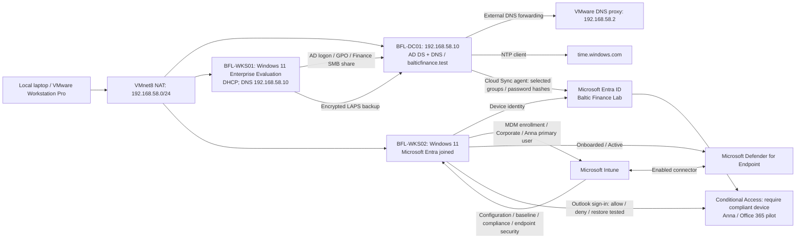

# WORK IN PROGRESS

# hybrid-enterprise-security-project

A hands-on Microsoft hybrid security lab for the fictional organization **Baltic Finance**. The lab is built and operated manually by the project owner, with guided review and troubleshooting.

## Current status

**Days 01–12: recorded functional scope completed. Day 13: remediation and functional tests completed; Defender reassessment pending. Day 14: recorded Sentinel ingestion, detection and incident-handling scope completed. Day 15: both capstone scenarios completed and verified. Documentation updated: 2026-10-05.**

Implemented: one local Windows Server 2025 domain controller, AD DS, DNS, organizational units, users, security groups, and external time synchronization. Day 02 adds a domain-joined Windows 11 workstation, scoped GPOs, password/lockout policy, session-lock testing, Finance share authorization and mapping, and local administrator group management. Day 03 adds a tested administrative identity, encrypted Windows LAPS, group-change auditing and a working gMSA task. Day 04 connects the existing Entra tenant through a Cloud Sync pilot; Anna's cloud login with her AD password succeeded (owner-confirmed). Day 05 diagnoses a controlled group-scope exclusion, verifies creation after correction and propagates the test account's disabled state to Entra ID. Day 06 adds BFL-WKS02 as a separate Entra-joined, Intune-managed workstation with Corporate ownership and Anna as primary user. Day 07 adds tested five-minute session lock, enforced Edge SmartScreen with a blocked-site test, and a tailored Windows 25H2 security baseline on BFL-WKS02. Day 08 adds pilot compliance and Conditional Access, with Outlook access allowed, blocked after controlled OS-version noncompliance, and restored while the policy remains On. Day 09 adds dedicated antivirus, firewall, BitLocker and ASR policies with selected functional tests, plus MDE onboarding, managed Tamper Protection and manual BitLocker key rotation. Day 10 validates Azure RBAC through tag-write allow/deny, Defender for Cloud read access and Blob data read/write/revocation tests. Its temporary Storage account and resource group were cleaned up. Existing Azure resources visible in the subscription were not deployed or remediated during Day 10; Sentinel is documented separately in Day 14. Day 11 validates Key Vault access through a new Automation system-assigned managed identity: initial read denial, authorized read, write denial and read denial after role removal. Day 12 validates private HTTP connectivity between two new Azure subnets, a targeted NSG deny, matching-rule diagnostics and restored access. Both test VMs were subsequently Stopped (deallocated), owner-confirmed. Day 13 reviews Defender for Cloud posture and restricts an existing Storage account to selected networks. The client VM's managed identity successfully reads the existing blob before and after removal of the workstation IP rule; the workstation subsequently receives HTTP 403. The client was deallocated again after testing. Defender recommendation clearance and Secure Score improvement remain unverified. Day 14 adds law-bfl-sentinel in North Europe, subscription Azure Activity collection, a tested KQL rule and a real incident from an authorized workspace tag change. Incident ID 3 and both alerts were resolved as Benign Positive; the demonstration rule is now Disabled. Day 15 connects Azure RBAC changes to a Sentinel investigation and manual access revocation, then validates endpoint noncompliance → Conditional Access denial → compliance and access restoration. Incident ID 5 is resolved, Sara's test Reader assignment is removed, both demonstration rules are Disabled, and BFL-WKS02 is Compliant with a successful Outlook sign-in and CA evaluation.

- [Day 01 implementation and troubleshooting](docs/day-01.md)
- [Day 01 test record](tests/day-01.md)
- [Evidence inventory and screenshot checklist](evidence/day-01/README.md)
- [Selected actual console output](evidence/day-01/console-excerpts.md)
- [Day 02 implementation and troubleshooting](docs/day-02.md)
- [Day 02 test record](tests/day-02.md)
- [Day 02 screenshots and descriptions](evidence/day-02/README.md)
- [Day 02 console evidence](evidence/day-02/console-excerpts.md)
- [Day 03 implementation](docs/day-03.md) · [Tests](tests/day-03.md) · [Evidence](evidence/day-03/README.md)
- [Day 04 implementation](docs/day-04.md) · [Tests](tests/day-04.md) · [Evidence](evidence/day-04/README.md)
- [Day 05 troubleshooting](docs/day-05.md) · [Tests](tests/day-05.md) · [Evidence](evidence/day-05/README.md)
- [Day 06 Entra join and Intune enrollment](docs/day-06.md) · [Tests](tests/day-06.md) · [Evidence](evidence/day-06/README.md)
- [Day 07 configuration and baseline](docs/day-07.md) · [Tests](tests/day-07.md) · [Evidence](evidence/day-07/README.md)
- [Day 08 compliance and Conditional Access](docs/day-08.md) · [Tests](tests/day-08.md) · [Evidence](evidence/day-08/README.md)
- [Day 09 endpoint security and MDE](docs/day-09.md) · [Tests](tests/day-09.md) · [Evidence](evidence/day-09/README.md)
- [Day 10 Azure RBAC and Blob access](docs/day-10.md) · [Tests](tests/day-10.md) · [Evidence](evidence/day-10/README.md)
- [Day 11 Key Vault and managed identity](docs/day-11.md) · [Tests](tests/day-11.md) · [Evidence](evidence/day-11/README.md)
- [Day 12 Azure networking and NSG filtering](docs/day-12.md) · [Tests](tests/day-12.md) · [Evidence](evidence/day-12/README.md)
- [Day 13 Defender for Cloud and Storage network access](docs/day-13.md) · [Tests](tests/day-13.md) · [Evidence](evidence/day-13/README.md)
- [Day 14 Azure Activity, KQL and Sentinel](docs/day-14.md) · [Tests](tests/day-14.md) · [Evidence](evidence/day-14/README.md)
- [Day 15 capstone: RBAC response and compliant-device access](docs/day-15.md) · [Tests](tests/day-15.md) · [Evidence](evidence/day-15/README.md)
- [Project roadmap](PROJECT-PLAN.md)

## Implemented architecture

The pilot now includes four staff identities and one retained, disabled test identity (tst.sync), scoped through three security groups.

The DC's IPv4 DNS client uses 127.0.0.1. NAT provides outbound connectivity; it is not a complete isolation boundary.

Day 10 temporarily used Azure subscription 1 → rg-bfl-rbac-lab → stbflrbaclab01 → rbac-test for RBAC validation. That test scope was deleted after the tests and is not a persistent component in the diagram above.

Day 12 used rg-bfl-network-lab / vnet-bfl-day12 with snet-client (10.120.1.0/24) and snet-server (10.120.2.0/24). The server subnet's NSG controlled private TCP 8080 access from the test client. See the [network test topology](docs/day-12.md#topology-and-resources). The two VMs are recorded as deallocated after the exercise.

Day 13 reuses the client subnet through a Microsoft.Storage service endpoint and permits its VM identity to read the identity-lab container in bflmi13a7k29. Final Storage settings allow selected networks with one VNet, no public IPv4 allow rules and a retained trusted-services exception. This is not a Private Endpoint deployment.

Day 14 streams subscription Activity logs through Azure Policy-deployed diagnostic settings into law-bfl-sentinel in rg-bfl-sentinel-lab, North Europe. A scheduled rule detected a successful workspace tag write and generated grouped alerts in Defender incident ID 3. The incident is resolved and the rule disabled; collection resources are retained.

## Remaining target architecture

The AD-to-Entra pilot and enrollment of BFL-WKS02 into Intune are implemented. Pilot configuration profiles and a tailored Windows baseline are deployed. Pilot compliance and Conditional Access are validated for Anna's Outlook sign-ins. Dedicated endpoint policies and MDE onboarding are implemented for BFL-WKS02. Azure RBAC and selected data-access tests are completed. Key Vault managed-identity read, write-denial and revocation tests are completed. Azure VNet/subnet and NSG allow/deny/restore tests are completed. Day 13 Storage remediation and functional validation are recorded; Defender reassessment remains pending. Day 14 validates Azure Activity ingestion, scheduled detection and manual incident resolution. Day 15 completes the selected capstone workflows: Reader grant → Sentinel alert → exact-assignment investigation → removal and denial; compliant-device access → deliberate OS-version noncompliance → CA block → recovery with CA Success. Remaining stages: confirmation of the Day 13 assessment and final security assessment. BFL-WKS01 remains AD joined; BFL-WKS02 is Entra joined and is not hybrid joined.

The project emphasizes least privilege, justified security settings, positive and negative tests, log verification, troubleshooting, and cost control.

## Evidence and limitations

PASS applies only to tests actually performed and supported by supplied output. Published console excerpts were transcribed from the owner's session; they are not new automated test runs. Seven Day 01, ten Day 02, seven Day 03, six Day 04, three Day 05, three Day 06, five Day 07, eight Day 08, sixteen Day 09, thirteen Day 10, seven Day 11, eight Day 12, fourteen Day 13, twelve Day 14 and twenty-two Day 15 screenshots are published. Client logon, GPO scope, Finance allow/deny access and drive mapping were tested. The session-lock test is an owner observation. adm.onprem now belongs to GG-Workstation-Admins and passed a workstation administration test. Cloud Sync group membership checks, preservation of old cloud accounts and Anna's cloud login are owner confirmations; Day 04 exported cloud logs were not supplied. Day 05 includes a provisioning-log screenshot and copied export text showing AccountEnabled=False; denied login and session revocation were not tested.

Day 06 screenshots confirm join status, Intune management, Corporate ownership and primary user. Scope saving and license assignment are owner-confirmed. The displayed Compliant badge does not establish custom compliance-policy enforcement. An existing M365 E5 trial was used; the owner reported approximately three weeks remaining on 2026-10-02.

Day 07 combines Intune reports, effective Edge policies, a blocked demonstration page and owner-observed lock/regression tests. Baseline Success does not prove every control; final full configuration export and snapshot recovery were not verified. Dedicated antivirus, firewall, ASR and BitLocker configuration and selected tests are recorded in Day 09.

Day 08 includes report-only evaluation, enforced success, deliberate OS-version noncompliance, denied access and recovery. Final device Compliant status, Outlook access and CA On are owner-confirmed. The tenant setting for devices without compliance policies remains Compliant; testing covers only the pilot. Emergency-account login and existing-session revocation were not tested.

Day 09 includes a quick scan, quarantine after the EICAR exercise, Edge outbound block/recovery, ASR events 1122/1121, MDE Onboarded/Active, managed Tamper Protection On and completed manual BitLocker key rotation. The obfuscated-script ASR rule remains Block; five other selected rules remain Audit. The temporary Edge block rule is Disabled. Expanded EICAR details, final firewall logging configuration, other ASR behaviors, EDR alert/response, boot recovery and automatic key rotation were not verified. Test-script cleanup was requested but not confirmed.

Day 10 includes real tag-save and Blob authorization failures, a successful file download with owner-confirmed contents, and access revocation. Contributor role-assignment denial was observed in the portal UI; no API attempt was made. Final Storage configuration was not exported. Cleanup is supported by the final group inventory and the owner's confirmation of Security Reader removal. The owner reported EUR 159.53 credit remaining on 2026-10-02, expiring 2026-10-13; actual exercise costs were not measured.

Day 11 uses seven screenshots to establish managed-identity authentication and operation-specific Key Vault authorization. The same read runbook failed before the role grant, completed with Key Vault Secrets User and failed after revocation; a separate secret-creation attempt was denied. No secret value was printed. Tests ran in Automation Test pane; runtime/settings exports, scheduled execution, private networking and exact propagation time were not verified.

Day 12 combines actual HTTP 200 → timeout → HTTP 200 results with Network Watcher deny/allow evaluations. The diagnostic source port was selected rather than captured from the application connection. The final client NIC NSG correction was instructed but not independently exported. Both VMs were confirmed deallocated; retained disks and public IPs can still incur charges. More than EUR 156 credit remained at preparation, owner-reported on 2026-10-05, with expiry 2026-10-13. Actual costs were not measured.

Day 13 records a 34% Secure Score baseline, selected-network remediation, container-scoped Storage Blob Data Reader and two HTTP 200 / 205-byte managed-identity reads. A workstation portal request returned 403 after its IP rule was removed. The final Defender view still lists the account; no cleared recommendation or score increase is claimed. Defender CSPM is On with Partial coverage, and the owner accepted its cost. Client deallocation is owner-confirmed. [Detailed limitations and follow-up](docs/day-13.md#results-and-limitations).

Day 14 uses an authorized workspace tag change rather than a malicious action. AzureActivity ingestion and _ResourceId-based filtering were verified, followed by a scheduled alert and incident ID 3 with two grouped alerts. The final incident is Resolved / Benign Positive and both alerts are resolved. Entity mapping and automated response were not configured. The rule is Disabled; no post-disable negative test or complete configuration export was collected. Actual costs and trial-benefit eligibility were not measured. [Day 14 limitations](docs/day-14.md#final-state-and-limitations).

Day 15 correlates a successful role-assignment write to a Sentinel alert and verifies Sara / Reader / resource-group scope through the exact assignment ID. After removal, current assignments are zero and resource-group read is denied. Incident ID 5 is Resolved / Benign Positive, both alerts are resolved and the rule is Disabled. The endpoint scenario isolates Minimum OS version as the failed check, records the intended CA policy's Failure, then verifies device Compliant and Outlook/CA Success after the rollback workflow. No privileged-role attack, automated response, Sentinel incident for endpoint compliance, full configuration export or session-revocation timing is claimed. [Day 15 evidence limits](docs/day-15.md#final-state-and-evidence-limits).

This is a single-DC educational lab, not a production-ready or comprehensively secured environment. Passwords, DSRM credentials, tokens, VM disks, and installation media must not be committed.
