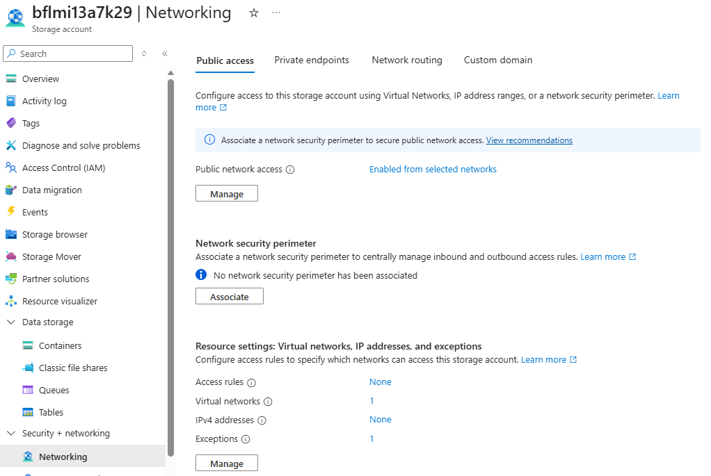
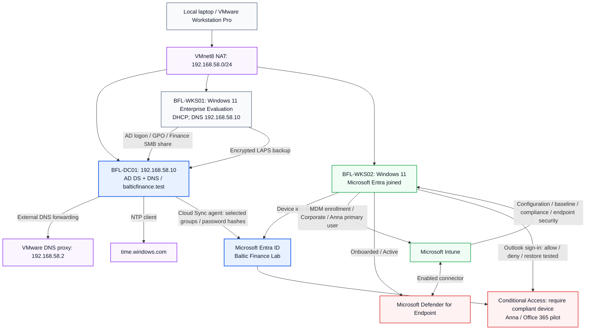

<h1 align="center">Microsoft Hybrid Enterprise Security Project</h1>

<strong>Active Directory · Endpoint Security · Azure</strong>

  
  

  
  
  
  
  
  

  <a href="#project-overview">Overview</a> ·
  <a href="#implemented-architecture">Architecture</a> ·
  <a href="#featured-implementation-evidence">Featured evidence</a> ·
  <a href="#milestones-and-evidence">Lab roadmap</a> ·
  <a href="#supporting-documentation">Documentation</a> ·
  <a href="#security-design-principles">Security principles</a>

A practical Microsoft security lab connecting local Active Directory, Entra ID, Intune and Azure. Built and operated manually by the project owner for the fictional organization **Baltic Finance**.

The repository demonstrates scoped authorization, hybrid identity, endpoint protection, cloud posture review and security investigation through documented implementation, positive and negative tests, troubleshooting and evidence.

## Project Overview

**Status: completed educational scope — Days 01–15 and final security assessment.**  
Documentation closure: **2026-10-07**. Published evidence: **143 screenshots**, daily test records and selected console output. Cloud resource retirement has not been performed as part of closure.

Each milestone connects configuration to observed behavior: an allowed operation, an expected denial, a supporting log or a verified recovery. The project serves as a practical learning environment and a technical portfolio.

## Explore the Project

| Architecture | Implementation | Validation | Evidence |
|:---:|:---:|:---:|:---:|
| [View design](#implemented-architecture) | [Browse labs](#milestones-and-evidence) | [Open tests](tests/) | [Open screenshots](evidence/) |
| Hybrid identity and endpoint flows | 15 documented milestones | Positive and negative testing | 143 published screenshots |

## Technologies and Concepts

| Area | Implemented technologies and concepts |
|---|---|
| Local identity | Windows Server 2025, AD DS, DNS, GPO, Windows LAPS, gMSA |
| Hybrid identity | Microsoft Entra ID, Cloud Sync, password hash synchronization, scoped groups |
| Endpoint management | Windows 11, Entra join, Microsoft Intune, configuration profiles, compliance |
| Endpoint security | Defender Antivirus, firewall, BitLocker, ASR, Defender for Endpoint |
| Access and workload identity | Conditional Access, Azure RBAC, managed identities, Key Vault, Azure Automation |
| Cloud networking and posture | VNets, subnets, NSGs, Network Watcher, Storage service endpoints, Defender for Cloud |
| Detection and investigation | Azure Activity, Log Analytics, KQL, Microsoft Sentinel, manual incident response |

---

## Demonstrated outcomes

| Security objective | Recorded outcome |
|---|---|
| Restrict access by role and scope | Finance share, workstation administration, Blob and Key Vault allow/deny tests; selected access revocation tests |
| Manage hybrid identities and endpoints | Group-scoped Cloud Sync, controlled provisioning fault/recovery, separate Entra join, Intune enrollment and policies |
| Enforce device-based access | Outlook allowed when compliant, blocked during deliberate OS-version noncompliance, restored with the intended CA policy succeeding |
| Validate endpoint protections | SmartScreen block, quarantine after an EICAR exercise, firewall block/recovery, ASR audit/block and manual BitLocker key rotation |
| Investigate and respond | Azure Activity detection, exact role-assignment investigation, manual revocation and resolved benign test incidents |
| Review cloud posture | Selected Storage recommendation Completed; Secure Score 34% → 77% after reassessment |

The Secure Score increase is **43 percentage points**, largely attributed by the owner to deletion of two older VMs no longer needed for licensing reasons. Exact contributions were not measured. The increase is not presented as a Storage-hardening gain alone or as a comprehensive security rating.

---

## Featured Implementation Evidence

Selected screenshots from the completed exercises. Each image links to its full evidence set; the daily records explain the test conditions and limitations.

<table>
<tr>
<td width="50%" align="center" valign="top">
   
  <strong>Device Compliance &amp; Conditional Access</strong> 
  <a href="docs/day-15.md">Day 15 documentation</a> · <a href="evidence/day-15/README.md">Evidence</a>
</td>
<td width="50%" align="center" valign="top">
   
  <strong>Sentinel Investigation &amp; Incident Resolution</strong> 
  <a href="docs/day-15.md">Day 15 documentation</a> · <a href="evidence/day-15/README.md">Evidence</a>
</td>
</tr>
<tr>
<td width="50%" align="center" valign="top">
   
  <strong>Managed Identity &amp; Key Vault Authorization</strong> 
  <a href="docs/day-11.md">Day 11 documentation</a> · <a href="evidence/day-11/README.md">Evidence</a>
</td>
<td width="50%" align="center" valign="top">
   
  <strong>Storage Network Access Controls</strong> 
  <a href="docs/day-13.md">Day 13 documentation</a> · <a href="evidence/day-13/README.md">Evidence</a>
</td>
</tr>
</table>

## Implemented architecture

The diagram shows the implemented local identity and managed-endpoint flows. The Azure exercises are summarized below it.

<strong>Architecture notes and Azure exercise scope</strong>

The pilot now includes four staff identities and one retained, disabled test identity (tst.sync), scoped through three security groups.

The DC's IPv4 DNS client uses 127.0.0.1. NAT provides outbound connectivity; it is not a complete isolation boundary.

Day 10 temporarily used Azure subscription 1 → rg-bfl-rbac-lab → stbflrbaclab01 → rbac-test for RBAC validation. That test scope was deleted after the tests and is not a persistent component in the diagram above.

Day 12 used rg-bfl-network-lab / vnet-bfl-day12 with snet-client (10.120.1.0/24) and snet-server (10.120.2.0/24). The server subnet's NSG controlled private TCP 8080 access from the test client. See the [network test topology](docs/day-12.md#topology-and-resources). The two VMs are recorded as deallocated after the exercise.

Day 13 reuses the client subnet through a Microsoft.Storage service endpoint and permits its VM identity to read the identity-lab container in bflmi13a7k29. Final Storage settings allow selected networks with one VNet, no public IPv4 allow rules and a retained trusted-services exception. This is not a Private Endpoint deployment.

Day 14 streams subscription Activity logs through Azure Policy-deployed diagnostic settings into law-bfl-sentinel in rg-bfl-sentinel-lab, North Europe. A scheduled rule detected a successful workspace tag write and generated grouped alerts in Defender incident ID 3. The incident is resolved and the rule disabled; collection resources are retained.

---

## Milestones and evidence

### Quick Lab Index

Each milestone links implementation, tests and an evidence page with individual screenshot descriptions.

| Day | Milestone | Implementation | Tests | Evidence |
|:---:|---|:---:|:---:|:---:|
| 01 | AD DS, DNS and lab foundation | [Notes](docs/day-01.md) | [Results](tests/day-01.md) | [Screenshots](evidence/day-01/README.md) |
| 02 | GPO scope and resource authorization | [Notes](docs/day-02.md) | [Results](tests/day-02.md) | [Screenshots](evidence/day-02/README.md) |
| 03 | Administrative access, LAPS and gMSA | [Notes](docs/day-03.md) | [Results](tests/day-03.md) | [Screenshots](evidence/day-03/README.md) |
| 04 | Entra Cloud Sync pilot | [Notes](docs/day-04.md) | [Results](tests/day-04.md) | [Screenshots](evidence/day-04/README.md) |
| 05 | Hybrid identity troubleshooting | [Notes](docs/day-05.md) | [Results](tests/day-05.md) | [Screenshots](evidence/day-05/README.md) |
| 06 | Entra join and Intune enrollment | [Notes](docs/day-06.md) | [Results](tests/day-06.md) | [Screenshots](evidence/day-06/README.md) |
| 07 | Configuration profiles and security baseline | [Notes](docs/day-07.md) | [Results](tests/day-07.md) | [Screenshots](evidence/day-07/README.md) |
| 08 | Compliance and Conditional Access | [Notes](docs/day-08.md) | [Results](tests/day-08.md) | [Screenshots](evidence/day-08/README.md) |
| 09 | Endpoint protection and MDE onboarding | [Notes](docs/day-09.md) | [Results](tests/day-09.md) | [Screenshots](evidence/day-09/README.md) |
| 10 | Azure RBAC and Blob authorization | [Notes](docs/day-10.md) | [Results](tests/day-10.md) | [Screenshots](evidence/day-10/README.md) |
| 11 | Key Vault and managed identity | [Notes](docs/day-11.md) | [Results](tests/day-11.md) | [Screenshots](evidence/day-11/README.md) |
| 12 | Azure networking and NSG filtering | [Notes](docs/day-12.md) | [Results](tests/day-12.md) | [Screenshots](evidence/day-12/README.md) |
| 13 | Defender for Cloud and Storage hardening | [Notes](docs/day-13.md) | [Results](tests/day-13.md) | [Screenshots](evidence/day-13/README.md) |
| 14 | Azure Activity, KQL and Sentinel | [Notes](docs/day-14.md) | [Results](tests/day-14.md) | [Screenshots](evidence/day-14/README.md) |
| 15 | Capstone: RBAC response and device-based access | [Notes](docs/day-15.md) | [Results](tests/day-15.md) | [Screenshots](evidence/day-15/README.md) |

### Detailed Lab Notes

Select a day to expand its recorded scope and supporting links. Completion applies to the documented tests, not every possible behavior of the technology.

<strong>Day 01 — AD DS, DNS and lab foundation</strong> · implementation, tests &amp; evidence

AD DS, DNS, organizational units and security groups, with selected domain-controller health checks and time-service troubleshooting.

[Documentation](docs/day-01.md) · [Tests](tests/day-01.md) · [Evidence](evidence/day-01/README.md)

---

<strong>Day 02 — GPO scope and resource authorization</strong> · implementation, tests &amp; evidence

GPO application and scope exclusion, account lockout, Finance share allow/deny tests and workstation local-group management.

[Documentation](docs/day-02.md) · [Tests](tests/day-02.md) · [Evidence](evidence/day-02/README.md)

---

<strong>Day 03 — Administrative access, LAPS and gMSA</strong> · implementation, tests &amp; evidence

Separate administrative access, standard-user denial, encrypted LAPS backup and rotation, group-change auditing and a working gMSA task.

[Documentation](docs/day-03.md) · [Tests](tests/day-03.md) · [Evidence](evidence/day-03/README.md)

---

<strong>Day 04 — Entra Cloud Sync pilot</strong> · implementation, tests &amp; evidence

Group-scoped Cloud Sync, synchronized staff identities, exclusion of the on-premises administrator and owner-confirmed cloud authentication.

[Documentation](docs/day-04.md) · [Tests](tests/day-04.md) · [Evidence](evidence/day-04/README.md)

---

<strong>Day 05 — Hybrid identity troubleshooting</strong> · implementation, tests &amp; evidence

Controlled provisioning-scope failure, correction through group membership and propagation of the test account's disabled state.

[Documentation](docs/day-05.md) · [Tests](tests/day-05.md) · [Evidence](evidence/day-05/README.md)

---

<strong>Day 06 — Entra join and Intune enrollment</strong> · implementation, tests &amp; evidence

A separate Entra-joined workstation, Intune enrollment, Corporate ownership and Anna Finance as primary user.

[Documentation](docs/day-06.md) · [Tests](tests/day-06.md) · [Evidence](evidence/day-06/README.md)

---

<strong>Day 07 — Configuration profiles and security baseline</strong> · implementation, tests &amp; evidence

Five-minute session lock, mandatory Edge SmartScreen and a tailored Windows security baseline with selected validation.

[Documentation](docs/day-07.md) · [Tests](tests/day-07.md) · [Evidence](evidence/day-07/README.md)

---

<strong>Day 08 — Compliance and Conditional Access</strong> · implementation, tests &amp; evidence

Compliant-device Conditional Access: Outlook access allowed, denied during controlled noncompliance and restored.

[Documentation](docs/day-08.md) · [Tests](tests/day-08.md) · [Evidence](evidence/day-08/README.md)

---

<strong>Day 09 — Endpoint protection and MDE onboarding</strong> · implementation, tests &amp; evidence

Selected antivirus, firewall and ASR tests, MDE onboarding, managed Tamper Protection and manual BitLocker recovery-key rotation.

[Documentation](docs/day-09.md) · [Tests](tests/day-09.md) · [Evidence](evidence/day-09/README.md)

---

<strong>Day 10 — Azure RBAC and Blob authorization</strong> · implementation, tests &amp; evidence

Management-plane authorization and Blob read/write/revocation tests, with the temporary test scope subsequently removed.

[Documentation](docs/day-10.md) · [Tests](tests/day-10.md) · [Evidence](evidence/day-10/README.md)

---

<strong>Day 11 — Key Vault and managed identity</strong> · implementation, tests &amp; evidence

Managed-identity Key Vault access: initial read denial, authorized read, separate write denial and read denial after revocation.

[Documentation](docs/day-11.md) · [Tests](tests/day-11.md) · [Evidence](evidence/day-11/README.md)

---

<strong>Day 12 — Azure networking and NSG filtering</strong> · implementation, tests &amp; evidence

Private HTTP connectivity between two subnets, targeted NSG denial, matching-rule diagnostics and restored access; both VMs recorded deallocated.

[Documentation](docs/day-12.md) · [Tests](tests/day-12.md) · [Evidence](evidence/day-12/README.md)

---

<strong>Day 13 — Defender for Cloud and Storage hardening</strong> · implementation, tests &amp; evidence

Selected-network Storage remediation and managed-identity read tests, followed by a Completed recommendation and a carefully attributed Secure Score reassessment.

[Documentation](docs/day-13.md) · [Tests](tests/day-13.md) · [Evidence](evidence/day-13/README.md)

---

<strong>Day 14 — Azure Activity, KQL and Sentinel</strong> · implementation, tests &amp; evidence

Azure Activity ingestion, target-specific KQL, scheduled detection, grouped alerts and a resolved benign test incident; rule retained Disabled.

[Documentation](docs/day-14.md) · [Tests](tests/day-14.md) · [Evidence](evidence/day-14/README.md)

---

<strong>Day 15 — Capstone: RBAC response and device-based access</strong> · implementation, tests &amp; evidence

Reader grant detection, exact-assignment investigation and manual revocation, plus endpoint noncompliance, CA denial and verified recovery.

[Documentation](docs/day-15.md) · [Tests](tests/day-15.md) · [Evidence](evidence/day-15/README.md)

---

## Supporting Documentation

- [Final security assessment](docs/final-security-assessment.md): verified controls, residual risks and production improvements.
- [Day 15 capstone](docs/day-15.md): role grant → Sentinel investigation → access removal; noncompliance → Conditional Access block → recovery.
- [Day 13 posture review](docs/day-13.md): Storage network hardening, functional verification and later recommendation reassessment.
- [Resource retention and cost plan](docs/resource-retention-plan.md): decisions for the owner before the reported Azure credit expiry.
- [Final repository review](tests/final-review.md) and [project roadmap](PROJECT-PLAN.md).

---

## Security Design Principles

**Least privilege and scope**

Role, group, resource and network boundaries are verified with selected positive and negative tests.

**Authentication and authorization separation**

A successful sign-in or managed-identity token does not by itself grant permission to read or modify a resource.

**Pilot before broader enforcement**

Device and access policies are exercised with limited pilot identities and devices before considering wider deployment.

**Investigation before remediation**

Configuration, logs and observed behavior establish the problem before the smallest corrective change is made.

**Verification and recovery**

Controlled tests include restored access, removed test grants and resolved incidents where documented.

**Evidence and cost awareness**

Configuration observations, functional results and owner confirmations remain distinct. Retained resources and trial limits require explicit ownership.

---

## Final recorded state

Sara's Day 15 Reader assignment was removed and resource-group read denial verified. Sentinel incidents 3 and 5 are resolved as Benign Positive; both demonstration rules are Disabled. Azure Activity collection resources remain. BFL-WKS02 is Compliant and Outlook/Conditional Access Success is recorded. The Day 12 VMs were confirmed deallocated by the owner; deletion is not claimed.

BFL-WKS01 remains AD joined. BFL-WKS02 is Entra joined, not hybrid joined. The local identity environment uses one DC and one Cloud Sync agent. Pilot tests do not establish tenant-wide coverage.

## Evidence boundaries

The owner executed the technical tests. Documentation updates are not new runtime tests. Daily records distinguish screenshots, supplied output and owner confirmations; PASS applies only to the stated check.

This is an educational lab, not a production-ready environment or security certification. Backup/restore, emergency-account access, broad policy coverage, MDE incident response and existing-session revocation timing remain untested. The [assessment](docs/final-security-assessment.md#residual-risks-and-production-improvements) prioritizes those gaps.

Earlier daily notes preserve what was known during each session. Later dated follow-ups and the final assessment describe subsequent outcomes. Current billing and exact trial expiry require an owner check; retained cloud resources are not assumed free. The [review record](tests/final-review.md) also identifies the limits of the publication/privacy review.

Passwords, DSRM credentials, tokens, recovery secrets, VM disks and installation media must not be committed.

---

## Repository Structure

| Path | Contents |
|---|---|
| [README.md](README.md) | Project overview, architecture, lab index and featured evidence |
| [PROJECT-PLAN.md](PROJECT-PLAN.md) | Milestone scope, completion status and recorded dependencies |
| [docs/](docs/) | Day 01–15 implementation notes, final assessment and resource/cost plan |
| [tests/](tests/) | Test procedures, observed results, evidence limits and final repository review |
| [evidence/](evidence/) | 143 screenshots, per-day descriptions and selected console excerpts |
