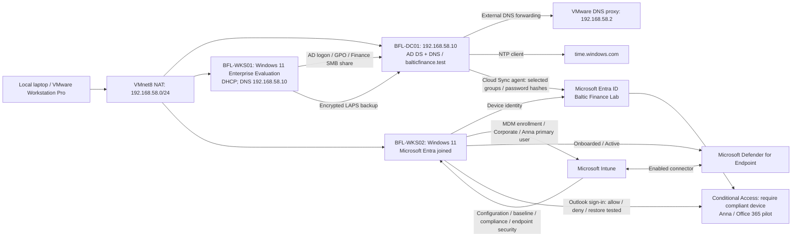

# Hybrid Enterprise Security Project — Baltic Finance

A practical Microsoft security lab connecting local Active Directory, Entra ID, Intune and Azure. Built and operated manually by the project owner for the fictional organization **Baltic Finance**.

**Status: completed educational scope — Days 01–15 and final security assessment.**  
Documentation closure: **2026-10-07**. Published evidence: **143 screenshots**, daily test records and selected console output. Cloud resource retirement has not been performed as part of closure.

## Start here

- [Final security assessment](docs/final-security-assessment.md): verified controls, residual risks and production improvements.
- [Day 15 capstone](docs/day-15.md): role grant → Sentinel investigation → access removal; noncompliance → Conditional Access block → recovery.
- [Day 13 posture review](docs/day-13.md): Storage network hardening, functional verification and later recommendation reassessment.
- [Resource retention and cost plan](docs/resource-retention-plan.md): decisions for the owner before the reported Azure credit expiry.
- [Final repository review](tests/final-review.md) and [project roadmap](PROJECT-PLAN.md).

## Demonstrated outcomes

| Security objective | Recorded outcome |
|---|---|
| Restrict access by role and scope | Finance share, workstation administration, Blob and Key Vault allow/deny tests; selected access revocation tests |
| Manage hybrid identities and endpoints | Group-scoped Cloud Sync, controlled provisioning fault/recovery, separate Entra join, Intune enrollment and policies |
| Enforce device-based access | Outlook allowed when compliant, blocked during deliberate OS-version noncompliance, restored with the intended CA policy succeeding |
| Validate endpoint protections | SmartScreen block, quarantine after an EICAR exercise, firewall block/recovery, ASR audit/block and manual BitLocker key rotation |
| Investigate and respond | Azure Activity detection, exact role-assignment investigation, manual revocation and resolved benign test incidents |
| Review cloud posture | Selected Storage recommendation Completed; Secure Score 34% → 77% after reassessment |

The Secure Score increase is **43 percentage points**, largely attributed by the owner to deletion of two older VMs no longer needed for licensing reasons. Exact contributions were not measured. The increase is not presented as a Storage-hardening gain alone or as a comprehensive security rating.

## Milestones and evidence

Each milestone links implementation, tests and an evidence page with individual screenshot descriptions.

| Day | Milestone | Implementation | Tests | Evidence |
|---|---|---|---|---|
| 01 | AD DS, DNS and lab foundation | [Notes](docs/day-01.md) | [Results](tests/day-01.md) | [Screenshots](evidence/day-01/README.md) |
| 02 | GPO scope and resource authorization | [Notes](docs/day-02.md) | [Results](tests/day-02.md) | [Screenshots](evidence/day-02/README.md) |
| 03 | Administrative access, LAPS and gMSA | [Notes](docs/day-03.md) | [Results](tests/day-03.md) | [Screenshots](evidence/day-03/README.md) |
| 04 | Entra Cloud Sync pilot | [Notes](docs/day-04.md) | [Results](tests/day-04.md) | [Screenshots](evidence/day-04/README.md) |
| 05 | Hybrid identity troubleshooting | [Notes](docs/day-05.md) | [Results](tests/day-05.md) | [Screenshots](evidence/day-05/README.md) |
| 06 | Entra join and Intune enrollment | [Notes](docs/day-06.md) | [Results](tests/day-06.md) | [Screenshots](evidence/day-06/README.md) |
| 07 | Configuration profiles and security baseline | [Notes](docs/day-07.md) | [Results](tests/day-07.md) | [Screenshots](evidence/day-07/README.md) |
| 08 | Compliance and Conditional Access | [Notes](docs/day-08.md) | [Results](tests/day-08.md) | [Screenshots](evidence/day-08/README.md) |
| 09 | Endpoint protection and MDE onboarding | [Notes](docs/day-09.md) | [Results](tests/day-09.md) | [Screenshots](evidence/day-09/README.md) |
| 10 | Azure RBAC and Blob authorization | [Notes](docs/day-10.md) | [Results](tests/day-10.md) | [Screenshots](evidence/day-10/README.md) |
| 11 | Key Vault and managed identity | [Notes](docs/day-11.md) | [Results](tests/day-11.md) | [Screenshots](evidence/day-11/README.md) |
| 12 | Azure networking and NSG filtering | [Notes](docs/day-12.md) | [Results](tests/day-12.md) | [Screenshots](evidence/day-12/README.md) |
| 13 | Defender for Cloud and Storage hardening | [Notes](docs/day-13.md) | [Results](tests/day-13.md) | [Screenshots](evidence/day-13/README.md) |
| 14 | Azure Activity, KQL and Sentinel | [Notes](docs/day-14.md) | [Results](tests/day-14.md) | [Screenshots](evidence/day-14/README.md) |
| 15 | Capstone: RBAC response and device-based access | [Notes](docs/day-15.md) | [Results](tests/day-15.md) | [Screenshots](evidence/day-15/README.md) |

## Implemented architecture

The pilot now includes four staff identities and one retained, disabled test identity (tst.sync), scoped through three security groups.

The DC's IPv4 DNS client uses 127.0.0.1. NAT provides outbound connectivity; it is not a complete isolation boundary.

Day 10 temporarily used Azure subscription 1 → rg-bfl-rbac-lab → stbflrbaclab01 → rbac-test for RBAC validation. That test scope was deleted after the tests and is not a persistent component in the diagram above.

Day 12 used rg-bfl-network-lab / vnet-bfl-day12 with snet-client (10.120.1.0/24) and snet-server (10.120.2.0/24). The server subnet's NSG controlled private TCP 8080 access from the test client. See the [network test topology](docs/day-12.md#topology-and-resources). The two VMs are recorded as deallocated after the exercise.

Day 13 reuses the client subnet through a Microsoft.Storage service endpoint and permits its VM identity to read the identity-lab container in bflmi13a7k29. Final Storage settings allow selected networks with one VNet, no public IPv4 allow rules and a retained trusted-services exception. This is not a Private Endpoint deployment.

Day 14 streams subscription Activity logs through Azure Policy-deployed diagnostic settings into law-bfl-sentinel in rg-bfl-sentinel-lab, North Europe. A scheduled rule detected a successful workspace tag write and generated grouped alerts in Defender incident ID 3. The incident is resolved and the rule disabled; collection resources are retained.

## Final recorded state

Sara's Day 15 Reader assignment was removed and resource-group read denial verified. Sentinel incidents 3 and 5 are resolved as Benign Positive; both demonstration rules are Disabled. Azure Activity collection resources remain. BFL-WKS02 is Compliant and Outlook/Conditional Access Success is recorded. The Day 12 VMs were confirmed deallocated by the owner; deletion is not claimed.

BFL-WKS01 remains AD joined. BFL-WKS02 is Entra joined, not hybrid joined. The local identity environment uses one DC and one Cloud Sync agent. Pilot tests do not establish tenant-wide coverage.

## Evidence boundaries

The owner executed the technical tests. Documentation updates are not new runtime tests. Daily records distinguish screenshots, supplied output and owner confirmations; PASS applies only to the stated check.

This is an educational lab, not a production-ready environment or security certification. Backup/restore, emergency-account access, broad policy coverage, MDE incident response and existing-session revocation timing remain untested. The [assessment](docs/final-security-assessment.md#residual-risks-and-production-improvements) prioritizes those gaps.

Earlier daily notes preserve what was known during each session. Later dated follow-ups and the final assessment describe subsequent outcomes. Current billing and exact trial expiry require an owner check; retained cloud resources are not assumed free. The [review record](tests/final-review.md) also identifies the limits of the publication/privacy review.

Passwords, DSRM credentials, tokens, recovery secrets, VM disks and installation media must not be committed.
