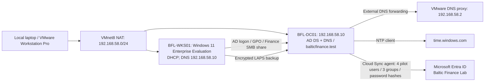

# hybrid-enterprise-security-project

A hands-on Microsoft hybrid security lab for the fictional organization **Baltic Finance**. The lab is built and operated manually by the project owner, with guided review and troubleshooting.

## Current status

**Days 01–04: recorded functional scope completed. Latest lab session: 2026-10-01.**

Implemented: one local Windows Server 2025 domain controller, AD DS, DNS, organizational units, users, security groups, and external time synchronization. Day 02 adds a domain-joined Windows 11 workstation, scoped GPOs, password/lockout policy, session-lock testing, Finance share authorization and mapping, and local administrator group management. Day 03 adds a tested administrative identity, encrypted Windows LAPS, group-change auditing and a working gMSA task. Day 04 connects the existing Entra tenant through a Cloud Sync pilot; Anna's cloud login with her AD password succeeded (owner-confirmed). No Intune, new Azure workload, Defender cloud integration or Sentinel deployment was performed in this project.

- [Day 01 implementation and troubleshooting](docs/day-01.md)
- [Day 01 test record](tests/day-01.md)
- [Evidence inventory and screenshot checklist](evidence/day-01/README.md)
- [Selected actual console output](evidence/day-01/console-excerpts.md)
- [Day 02 implementation and troubleshooting](docs/day-02.md)
- [Day 02 test record](tests/day-02.md)
- [Day 02 screenshots and descriptions](evidence/day-02/README.md)
- [Day 02 console evidence](evidence/day-02/console-excerpts.md)
- [Day 03 implementation](docs/day-03.md) · [Tests](tests/day-03.md) · [Evidence](evidence/day-03/README.md)
- [Day 04 implementation](docs/day-04.md) · [Tests](tests/day-04.md) · [Evidence](evidence/day-04/README.md)
- [Project roadmap](PROJECT-PLAN.md)

## Implemented architecture

The DC's IPv4 DNS client uses 127.0.0.1. NAT provides outbound connectivity; it is not a complete isolation boundary.

## Remaining target architecture

The AD-to-Entra pilot is implemented. Remaining project stages: Intune / Endpoint Security → Azure Security → Defender → Log Analytics → Microsoft Sentinel → Detection / Investigation / Response. BFL-WKS01 remains AD joined; Entra join and Intune enrollment are separate future work.

The project emphasizes least privilege, justified security settings, positive and negative tests, log verification, troubleshooting, and cost control.

## Evidence and limitations

PASS applies only to tests actually performed and supported by supplied output. Published console excerpts were transcribed from the owner's session; they are not new automated test runs. Seven Day 01, ten Day 02, seven Day 03 and six Day 04 screenshots are published. Client logon, GPO scope, Finance allow/deny access and drive mapping were tested. The session-lock test is an owner observation. adm.onprem now belongs to GG-Workstation-Admins and passed a workstation administration test. Cloud Sync group membership checks, preservation of old cloud accounts and Anna's cloud login are owner confirmations; exported cloud logs were not supplied. IE ESC restoration after agent setup remains unconfirmed. Backup/restore and replication between multiple DCs remain untested.

This is a single-DC educational lab, not a production-ready or comprehensively secured environment. Passwords, DSRM credentials, tokens, VM disks, and installation media must not be committed.
