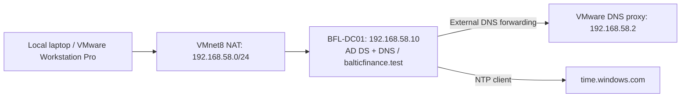

# hybrid-enterprise-security-project

A hands-on Microsoft hybrid security lab for the fictional organization **Baltic Finance**. The lab is built and operated manually by the project owner, with guided review and troubleshooting.

## Current status

**Day 01 configuration and listed server-side checks completed on 2026-09-30.**

Implemented: one local Windows Server 2025 domain controller, AD DS, DNS, organizational units, users, security groups, and external time synchronization. No Azure, Entra synchronization, Intune, Defender cloud integration, or Sentinel deployment has been completed.

- [Day 01 implementation and troubleshooting](docs/day-01.md)
- [Day 01 test record](tests/day-01.md)
- [Evidence inventory and screenshot checklist](evidence/day-01/README.md)
- [Selected actual console output](evidence/day-01/console-excerpts.md)
- [Project roadmap](PROJECT-PLAN.md)

## Implemented architecture

The DC's IPv4 DNS client uses 127.0.0.1. NAT provides outbound connectivity; it is not a complete isolation boundary.

## Target architecture — not yet implemented

On-premises AD → Hybrid Identity → Microsoft Entra ID → Intune / Endpoint Security → Azure Security → Defender → Log Analytics → Microsoft Sentinel → Detection / Investigation / Response.

The project emphasizes least privilege, justified security settings, positive and negative tests, log verification, troubleshooting, and cost control.

## Evidence and limitations

PASS applies only to tests actually performed and supported by supplied output. Published console excerpts were transcribed from the owner's session; they are not new automated test runs. Screenshots have **not** been uploaded. Client logon, GPO application, access-denial tests, backup/restore, and replication between multiple DCs have not been validated.

This is a single-DC educational lab, not a production-ready or comprehensively secured environment. Passwords, DSRM credentials, tokens, VM disks, and installation media must not be committed.
