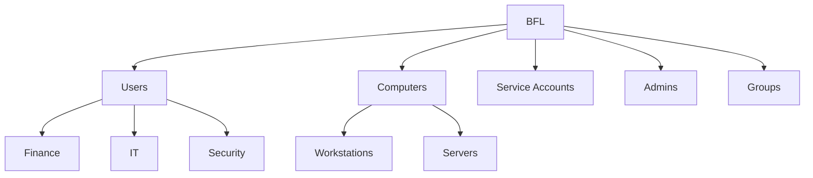

# Day 01 — Active Directory Foundation

Date: 2026-09-30. Status: configuration and listed server-side tests completed; seven screenshots published. This page records the Day 01 state; see [Day 02](day-02.md) for subsequent changes.

## Objective and context

Build the local identity foundation for Baltic Finance before adding hybrid and cloud services. All configuration was performed by the owner. Results below are based on supplied terminal output, reviewed screenshots, and explicitly identified owner confirmations.

## Configuration

| Component | Recorded state |
|---|---|
| Hypervisor | VMware Workstation Pro 26H1u1, 26.0.1.25688693 (owner reported) |
| VM | BFL-DC01; 4 GB RAM, 2 vCPU, 60 GB growable disk (owner confirmed) |
| OS | Windows Server 2025 Standard Evaluation, Desktop Experience; build family 26100 |
| Updates | Owner confirmed all offered updates installed; final UBR and KB list not captured |
| VMware Tools | VMTools service Running |
| Network | VMnet8 NAT; 192.168.58.0/24; gateway 192.168.58.2 |
| DHCP pool | 192.168.58.128–192.168.58.254, verified from VMware screenshots |
| Server IPv4 | Static 192.168.58.10/24; DHCP disabled |
| AD forest / domain | balticfinance.test |
| NetBIOS | BFL |
| Functional levels | Windows2025Forest / Windows2025Domain |
| DC capabilities | DNS and Global Catalog; no parent DNS delegation |
| Database / transaction logs | C:\Windows\NTDS |
| SYSVOL | C:\Windows\SYSVOL |
| IPv4 DNS client after promotion | 127.0.0.1 |
| DNS forwarder | 192.168.58.2; UseRootHint True |
| Time zone | Central European Standard Time |
| PDC time source after repair | time.windows.com,0x8; Active, client mode |
| Evaluation activation | Expiration reported as 29.03.2027 15:10:07; timestamp as displayed by server |

The private .test namespace is reserved for testing. Cloud UPN planning remains Day 04 work. No public domain, cloud identity synchronization or endpoint enrollment was configured.

### Organizational units



Eleven custom OUs were created. Protection was verified True for the first ten; the Groups creation command explicitly enabled protection, but its property was not separately re-queried. BFL-DC01 remains in the built-in Domain Controllers OU; Servers is intended for member servers.

### Users and groups

| Account | OU beneath BFL | Confirmed group assignment |
|---|---|---|
| anna.finance | Users/Finance | GG-Finance |
| peter.finance | Users/Finance | GG-Finance |
| adam.it | Users/IT | GG-IT |
| sara.security | Users/Security | GG-Security |
| adm.onprem | Admins | Domain Users only, verified before group creation |

All five accounts were confirmed enabled, with UPN suffix balticfinance.test, pwdLastSet = 0 and PasswordNeverExpires = False. Initial password change at client logon is configured but not yet tested. Passwords were entered interactively using Read-Host -AsSecureString; none are stored here.

Four Global/Security groups exist under Groups: GG-Finance (2 members), GG-IT (1), GG-Security (1), GG-Workstation-Admins (0). No workstation administrator assignment has been made. Departmental membership alone does not establish access to any resource.

## Security rationale

- A static IP outside the DHCP pool avoids automatic lease changes for AD/DNS.
- The DC resolves domain names through its own DNS; external requests can be forwarded to the VMware DNS proxy.
- OU structure prepares GPO targeting and delegation; OU location is not itself a privilege grant.
- Separate adm.onprem identity is reserved for administration without adding broad rights in advance.
- DSRM credentials were entered locally and are excluded from documentation.
- Local VMs avoid Azure compute costs. NAT is not a complete security boundary.

## Problems encountered and troubleshooting

### Missing departmental OUs

**Problem:** an OU query returned seven objects; Finance, IT and Security were absent.  
**Investigation:** compared actual distinguished names with the planned tree.  
**Root cause:** the required objects had not been created at that point; why the earlier creation block did not run was not independently established.  
**Resolution:** the owner ran the creation block for the three missing OUs only.  
**Verification:** all three appeared beneath Users with accidental-deletion protection True.

### DNS delegation warning

The promotion prerequisite check passed while reporting that the authoritative parent zone could not be found. This is expected for this standalone .test lab without a managed parent zone. No delegation was created. Subsequent DNS basic tests and domain SRV resolution passed. This warning was not a DNS outage.

### PDC using its local clock

**Problem:** W32Time reported Local CMOS Clock, reference LOCL.  
**Investigation:** BFL-DC01 held PDC Emulator; Type was NT5DS and the peer was unnamed/Pending.  
**Root cause:** the forest-root PDC had no configured usable upstream time source and was still using domain-hierarchy mode.  
**Resolution executed by the owner:**

```powershell
w32tm /config /manualpeerlist:"time.windows.com,0x8" /syncfromflags:manual /reliable:yes /update
Restart-Service W32Time
w32tm /resync /rediscover
```

**Verification:** resync succeeded; source changed to time.windows.com,0x8; peer Active, mode 3 (Client); server stratum 5 and upstream stratum 4. Last successful synchronization was 30.09.2026 17:59:09 as reported by the server.

The initial West Central Africa time zone was also changed to Central European Standard Time and later verified. Time-zone selection and synchronization are separate settings.

## Result and lessons learned

The first DC is operational according to the specific checks in the [test record](../tests/day-01.md). The session demonstrated configuration → test → output and a genuine time-service investigation.

A plan is not evidence: missing OUs were detected by querying AD. Installing the AD DS role is distinct from creating a forest. DNS delegation warnings must be interpreted in context. A plausible clock display is not proof of upstream synchronization.

## Remaining work and limitations

- The [seven screenshots](../evidence/day-01/README.md) and console excerpts are published.
- Client domain join, first-password-change logon, GPO application, and access-denial tests were not performed.
- No second DC, replication-partner test, backup/restore test or comprehensive security assessment.
- No persistent event-log export was collected; console diagnostics are not event-log evidence.
- Only one NTP source; VMware time synchronization interaction and behavior after suspend/reboot remain untested.
- Final patch inventory was not captured.
- Follow-up: client provisioning and GPO tests were subsequently performed on [Day 02](day-02.md).

## References

- [Microsoft: Install AD DS](https://learn.microsoft.com/en-us/windows-server/identity/ad-ds/deploy/install-active-directory-domain-services--level-100-)
- [Microsoft: dcdiag](https://learn.microsoft.com/en-us/windows-server/administration/windows-commands/dcdiag)
- [Microsoft: Windows Time tools](https://learn.microsoft.com/en-us/windows-server/networking/windows-time-service/windows-time-service-tools-and-settings)
- [RFC 2606: reserved test names](https://datatracker.ietf.org/doc/rfc2606/)
