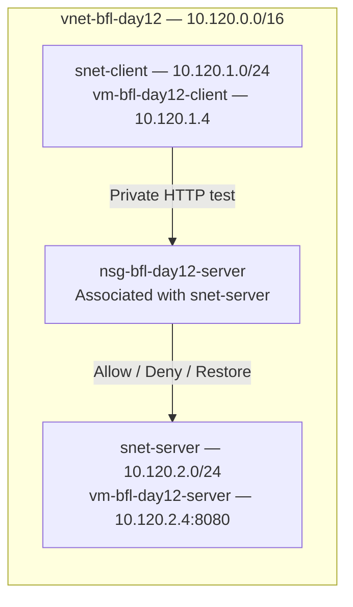

# Day 12 — Azure networking and NSG traffic filtering

**Session:** 2026-10-05. **Status:** recorded functional tests completed; both test VMs Stopped (deallocated), owner-confirmed.

[Tests](../tests/day-12.md) · [8 screenshots](../evidence/day-12/README.md) · [Session excerpts](../evidence/day-12/console-excerpts.md)

## Objective and context

Build a separate Azure network lab and demonstrate client-to-server TCP access through an allow → deny → restore sequence. Correlate real HTTP results with Network Watcher IP flow verify to identify the matching NSG rule.

The owner performed all Azure actions manually. New resources were used for the network test. The subscription was Azure subscription 1 in Baltic Finance Lab. The owner reported more than EUR 156 credit remaining, expiring 2026-10-13; this was not a billing export.

## Topology and resources

| Resource | Recorded configuration |
|---|---|
| Resource group | rg-bfl-network-lab, Poland Central |
| VNet | vnet-bfl-day12, 10.120.0.0/16 |
| Client subnet | snet-client, 10.120.1.0/24 |
| Server subnet | snet-server, 10.120.2.0/24 |
| Server NSG | nsg-bfl-day12-server, associated with snet-server |
| Client VM | vm-bfl-day12-client, 10.120.1.4 |
| Server VM | vm-bfl-day12-server, 10.120.2.4 |
| Test service | Python HTTP server, TCP 8080, bound to 10.120.2.4 |
| Public IP names in setup | pip-bfl-day12-client and pip-bfl-day12-server |



The diagram represents the tested path, not the final running state. Both VMs were later deallocated. No connection to the earlier hybrid VNet was configured in this exercise.

Screenshot 01 verifies the two subnet ranges. Screenshot 02 verifies the server NSG association. The owner confirmed both VM private addresses and Running status before testing; the functional results establish a working private path between them.

## VM setup and security boundary

The supplied Review + create summaries specified both VMs as Ubuntu Server 24.04 LTS, x64, Standard B2als_v2, Standard security type, no infrastructure redundancy and no Spot pricing. They used SSH public-key authentication with azureuser and Standard SSD LRS managed OS disks. The OS disks were configured to be deleted with their VMs. No data disks were added.

The server summary showed the existing VNet and snet-server, a new public IP, no NIC-level NSG and deletion of its public IP/NIC with the VM enabled. Its protection was configured at the subnet through nsg-bfl-day12-server.

The client summary initially showed NIC NSG None and public-IP/NIC deletion Disabled. The owner was instructed to change these to **Basic NSG with Public inbound ports None**, and deletion Enabled before creating the VM. The next confirmation supplied Running status and the private IP, not a corrected summary or NSG export. Those two final client settings are therefore not independently verified.

Other supplied setup choices: managed identity, Entra login, Backup, Site Recovery, periodic assessment, hibernation and alerts Off; boot diagnostics On; no extra VM applications or custom cloud-init. Auto-shutdown was Off; stopping the VMs was a manual action after the tests.

Public IPs provided an explicit outbound path for management operations. The test itself used only private addresses. Public inbound ports were instructed to remain None; no Internet-facing SSH or HTTP connectivity test was performed. Azure Run Command requires outbound HTTPS connectivity to return results; see the [Run Command documentation](https://learn.microsoft.com/en-us/azure/virtual-machines/linux/run-command).

Tags used in the setup were Project=BalticFinance, Environment=Lab and Purpose=Day12-Network. Tag lists in the wizard covered multiple resource types; their presence does not prove that every listed resource type was deployed.

## Server listener

On vm-bfl-day12-server, the owner ran the following through **Run command → RunShellScript**:

```bash
set -eu

command -v python3

mkdir -p /var/tmp/bfl-day12
printf 'Baltic Finance - Day 12 network test\n' \
  > /var/tmp/bfl-day12/index.html

systemd-run --unit=bfl-day12-http \
  --property=Restart=on-failure \
  /usr/bin/python3 -m http.server 8080 \
  --bind 10.120.2.4 \
  --directory /var/tmp/bfl-day12

sleep 2
systemctl is-active bfl-day12-http
ss -lntp 'sport = :8080'
```

The supplied output showed /usr/bin/python3, active and LISTEN on 10.120.2.4:8080. The service exposed only the directory containing the demonstration text. The systemd-run message on stderr reported successful unit creation, not a failure.

This is a transient test service, not a production web deployment or a persistent startup configuration. Before repeating the lab after a VM restart, recheck the listener and recreate the transient service if necessary. The HTTP service uses plaintext and contains no sensitive test data.

## Baseline HTTP test

The same client script was used before the deny rule, after adding it and after removing it:

```bash
python3 - <<'PY'
import urllib.request

url = "http://10.120.2.4:8080/"
opener = urllib.request.build_opener(urllib.request.ProxyHandler({}))

with opener.open(url, timeout=10) as response:
    body = response.read().decode().strip()
    print(f"HTTP status: {response.status}")
    print(f"Response: {body}")
    assert response.status == 200
    assert body == "Baltic Finance - Day 12 network test"
    print("PASS: client-to-server HTTP connection allowed.")
PY
```

The proxy handler disables proxy use for this request, so the script targets the private server directly. Each execution creates a new connection. The first execution returned HTTP 200, the expected text and the PASS marker (03).

## Controlled inbound deny

The owner added this rule to nsg-bfl-day12-server:

| Field | Value |
|---|---|
| Direction | Inbound |
| Source | IP Addresses: 10.120.1.4/32 |
| Source port ranges | * |
| Destination | IP Addresses: 10.120.2.4/32 |
| Destination port | 8080 |
| Protocol | TCP |
| Action | Deny |
| Priority | 100 |
| Name | Deny-Client-To-Server-8080 |

Screenshot 04 shows the rule. Its priority takes precedence over the default AllowVnetInBound rule at 65000. The repeated HTTP test failed with TimeoutError and urllib.error.URLError: <urlopen error timed out> (05). The success marker did not appear.

The timeout alone would not identify the cause. Network Watcher was then used against the server NIC with TCP, Inbound, local 10.120.2.4:8080 and remote 10.120.1.4:60000. Screenshot 06 returned **Access denied**, naming **Deny-Client-To-Server-8080** in **nsg-bfl-day12-server**.

Port 60000 was a selected diagnostic source port; it was not captured from the actual HTTP session. The deny rule covered every source port, so the diagnostic tuple evaluated the same relevant rule conditions. IP flow verify evaluates security rules, whereas the HTTP script exercises the real connection and application response. See [IP flow verify](https://learn.microsoft.com/en-us/azure/network-watcher/ip-flow-verify-overview).

## Restore and verification

After removal of only the custom deny rule, the owner ran the unchanged HTTP script again. It returned HTTP 200, the expected text and PASS (07).

Repeating IP flow verify with the same diagnostic tuple returned **Access allowed** through **AllowVnetInBound** (08). Together, the application and diagnostic results support the allow → deny → restore sequence.

Separate subnets did not by themselves prevent this communication. The default intra-VNet allow applied until the more specific, higher-priority deny was added. The restored state is a demonstrated baseline, not a production least-privilege rule set.

## Troubleshooting

| Observation | Investigation / action | Evidence boundary |
|---|---|---|
| Address field initially remained 10.0.0.0/16 | Edited VNet address space, then corrected snet-client from 10.120.0.0/24 to 10.120.1.0/24 | Final subnet screenshot 01 confirms both ranges |
| Deployment Overview supplied instead of subnet list | Opened the resource's Subnets page | Final 01 replaced the earlier setup views |
| VM needed 2 vCPUs while 0 of 4 remained | Requested quota inspection; owner later reported the issue resolved | Exact corrective action and quota category were not supplied |
| Public-IP creation hit a quota error with malformed [object Object] text | Owner reported success after guidance on deleting an unused public IP | Deleted address identity and attachment state were not independently recorded |
| VM wizard switched to a new 172.16.0.0/24 network | Restored existing vnet-bfl-day12 and intended subnet before deployment | Server review summary and test path use intended network |
| Client summary omitted its NIC NSG and deletion flags | Provided the two corrections before creation | Corrected final settings export not supplied |
| Run Command banner said Enable succeeded | Inspected stdout/stderr for HTTP response or exception | A successful extension invocation was not treated as an application-test pass |

## Final state and costs

The owner explicitly confirmed both vm-bfl-day12-client and vm-bfl-day12-server as **Stopped (deallocated)** after testing. This is an owner confirmation rather than a final status screenshot. Resource deletion was not claimed.

VM compute allocation ended in that recorded state; retained disks and public IPs can still incur charges. The wizard displayed an approximate monthly compute estimate of USD 31.54 for the selected server size during setup; that was not a combined bill for both VMs, disks and addresses. No actual-cost reconciliation or final billing export was collected.

## Limitations and next milestone

The tests cover one client, one server, one TCP destination port and one deny rule. No UDP, ICMP, cross-VNet, Internet-ingress, packet-capture, flow-log, persistent-session or failover testing was performed. The exact rule propagation delay was not measured. Client NSG final state and a complete effective-rule inventory were not exported.

Next is **Day 13: Defender for Cloud posture review**. Inspect actual recommendations and available plans first, then select a scoped Finding → Risk → Recommendation → Remediation → Verification exercise. Do not treat earlier Not evaluated rows or zero counts as a completed assessment, and do not enable paid plans without first reviewing their cost and need.
