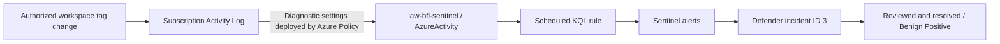

# Day 14 — Azure Activity, KQL and Microsoft Sentinel

Date: 2026-10-05  
Status: recorded ingestion, detection and incident-handling tests completed. Demonstration rule Disabled.

[Tests](../tests/day-14.md) · [Screenshots](../evidence/day-14/README.md) · [Observed output](../evidence/day-14/console-excerpts.md)

## Objective

Build and validate a small telemetry-to-incident workflow: Azure Activity → Log Analytics → KQL → scheduled Sentinel alert → incident investigation and classification → resolution.

The trigger was an authorized tag change on a lab workspace. It was not an attack simulation involving malware, exploitation or compromised credentials. The owner performed all Azure actions manually; documentation records supplied results rather than a new execution.

## Resources and architecture

| Component | Recorded value |
|---|---|
| Subscription | Azure subscription 1 |
| Resource group | rg-bfl-sentinel-lab |
| Log Analytics workspace | law-bfl-sentinel |
| Workspace region | North Europe |
| SIEM | Microsoft Sentinel; Analytics and incident handling in Microsoft Defender portal |
| Solution / connector | Azure Activity; connector page showed solution version 2.0.0 |
| Log table | AzureActivity |
| Policy assignment | BFL-Day14-AzureActivity |
| Policy definition | Configure Azure Activity logs to stream to specified Log Analytics workspace |
| Definition version | 1.0.0 reviewed; assignment displayed 1.*.* |
| Policy scope / enforcement | Subscription / Default |
| Effect / logsEnabled | DeployIfNotExists / True |
| Policy identity | System assigned; northeurope in owner-supplied creation summary |
| Remediation result | Complete, 1 out of 1 |
| Analytics rule | BFL-Day14-Workspace-Tag-Change |
| Test target | law-bfl-sentinel workspace, within rg-bfl-sentinel-lab |
| Incident | ID 3; final status Resolved, classification Benign Positive |



The existing law-bfl-identity workspace in Poland Central was inspected but was not the final Sentinel target. No VM needed to be started for this exercise.

## Implementation

### Workspace and regional troubleshooting

The existing workspace could not be selected for Sentinel: Add was disabled and the portal displayed a region-support warning. Poland Central was absent from the supported Sentinel region list consulted during the session. A new workspace was planned in West Europe, but the owner received “The selected region is currently not accepting new customers.” North Europe was then used successfully.

Screenshot 01 confirms law-bfl-sentinel in rg-bfl-sentinel-lab, North Europe, listed under Microsoft Sentinel. The Analytics page redirected to the Defender portal; this was an onboarding/UI transition rather than a failed deployment.

### Azure Activity collection

The Azure Activity solution was installed through Content hub. Its connector initially showed Not connected and no received data. The policy wizard assigned the built-in diagnostic-settings policy at subscription scope with law-bfl-sentinel as the destination.

The first review summary showed Create a remediation task: No. The owner was instructed to enable it before creation. The later assignment showed Remediation (1), and the task progressed from Evaluating / 0 out of 0 to **Complete / 1 out of 1**. This final result establishes that a remediation task actually ran.

Successful deployment alone was not used as proof of ingestion. A query first returned 0, then **5 events**, spanning 11:49:58.541 to 11:54:03.394 UTC. Inspection identified policy/deployment events with a shared correlation ID; they were not five independent user changes.

### Controlled tag change and query refinement

The instructions initially targeted the resource group's tags. Actual event data established that the changes were made on **law-bfl-sentinel itself**. Detection was scoped to that observed workspace.

The test used the Day14Test tag, with ActivityLog-02 and then ActivityLog-03 as instructed values. The supplied log projections prove successful tag writes and their target, but do not independently show the tag key/value payload.

Filtering on ResourceGroup returned no rows, and projecting ResourceId did not expose the target. Querying **_ResourceId** and **Authorization_d.scope** revealed the workspace and its Microsoft.Resources/tags/default authorization scope. Both TAGS/WRITE and WORKSPACES/WRITE appeared in the correlated operation. The detection retained only successful TAGS/WRITE entries to avoid counting the accompanying workspace-write event as another trigger.

### Analytics rule

| Setting | Final recorded value |
|---|---|
| Type | Scheduled |
| Severity | Informational |
| Description | Lab detection of successful tag changes on law-bfl-sentinel. Authorized test activity; not evidence of an attack. |
| Frequency | Every 5 minutes |
| Lookback | Last 15 minutes |
| Threshold | Greater than 0 results |
| Event grouping | Group all events into a single alert |
| Suppression | Not configured / Off |
| Create incidents | Enabled |
| Alert grouping | Enabled; all alerts from this rule; 1 hour |
| Entity mapping | None configured |
| Final rule state | Disabled after the exercise |

The wizard initially displayed Hours for both scheduling fields; guidance corrected these to Minutes. Screenshot 07 verifies the saved 5-minute frequency and 15-minute lookback.

MITRE ATT&CK was left unassigned for this administrative demonstration. No automated-response playbook was configured. The rule's limited resource filter is appropriate to this lab, not a general enterprise detection.

## KQL used during the exercise

### 1. Verify ingestion

```kusto
AzureActivity
| where TimeGenerated > ago(24h)
| summarize Events = count(),
            FirstEvent = min(TimeGenerated),
            LastEvent = max(TimeGenerated)
```

Observed result: 5 events after an initial zero result. See screenshot 04, whose uploaded filename ends in `ingestio.png`.

### 2. Inspect operations without the failing ResourceGroup filter

```kusto
AzureActivity
| where TimeGenerated > ago(24h)
| project TimeGenerated, OperationNameValue,
          ActivityStatusValue, ResourceGroup, CorrelationId
| order by TimeGenerated desc
```

### 3. Identify the actual target of the first tag test

```kusto
AzureActivity
| where TimeGenerated > ago(24h)
| where CorrelationId == "d3994cdf-4d8d-46f6-a83d-250ff0e818d8"
| where ActivityStatusValue =~ "Success"
| project TimeGenerated,
          OperationNameValue,
          ActivityStatusValue,
          TargetResource = _ResourceId,
          AuthorizationScope = tostring(Authorization_d.scope)
```

This query returned the workspace as TargetResource. The correlation ID identifies the recorded test; replace it when investigating another operation.

### 4. Validate the detection in Logs

```kusto
AzureActivity
| where TimeGenerated > ago(24h)
| where OperationNameValue =~ "MICROSOFT.RESOURCES/TAGS/WRITE"
| where ActivityStatusValue =~ "Success"
| where _ResourceId endswith "/resourcegroups/rg-bfl-sentinel-lab/providers/microsoft.operationalinsights/workspaces/law-bfl-sentinel"
| project TimeGenerated,
          OperationNameValue,
          ActivityStatusValue,
          TargetResource = _ResourceId,
          CorrelationId
```

The post-rule check used `ago(1h)` and appended `| order by TimeGenerated desc`. It found the new event at 12:38:03.783 UTC.

### 5. Scheduled rule query

The rule uses its configured 15-minute lookback instead of the interactive query's 24-hour filter. TimeGenerated is retained in the results.

```kusto
AzureActivity
| where OperationNameValue =~ "MICROSOFT.RESOURCES/TAGS/WRITE"
| where ActivityStatusValue =~ "Success"
| where _ResourceId endswith "/resourcegroups/rg-bfl-sentinel-lab/providers/microsoft.operationalinsights/workspaces/law-bfl-sentinel"
| project TimeGenerated,
          OperationNameValue,
          ActivityStatusValue,
          TargetResource = _ResourceId,
          CorrelationId
```

The filter uses a workspace path suffix rather than publishing a subscription ID. If reused across a broader multi-subscription data scope, make the intended subscription boundary explicit.

## Detection and incident timeline

Log Analytics times below are UTC. The Defender screenshots display corresponding local times in Poland (UTC+2 on this date).

| Observation | Time or result |
|---|---|
| First test TAGS/WRITE Start | 12:06:58.796 UTC |
| First test TAGS/WRITE Success | 12:06:59.062 UTC |
| Related WORKSPACES/WRITE Success | 12:07:19.462 UTC, supplied query output |
| New post-rule TAGS/WRITE Success | 12:38:03.783 UTC / 14:38:03 local |
| Alert generated | 14:45:46 local |
| Incident ID 3 created | 14:45:47 local |
| Incident investigation view | Active; 2 alerts; no mapped entities |
| Final incident view | Resolved; Benign Positive; both alerts Resolved; Active alerts 0 |
| Final analytics view | Rule Disabled; active rules 0 |

The post-rule log and alert share correlation ID `29e1e880-73a8-425e-a663-50e89ddb0cc9`. The observed interval between the event and alert is approximately 7 minutes 42 seconds; it includes collection and scheduled detection and is not a general latency guarantee.

Two alerts were grouped into the incident. This is consistent with a 15-minute lookback running every 5 minutes; no rule-run export was collected to independently attribute every duplicate. Grouping consolidated the alerts but did not deduplicate the underlying query results.

The incident was reviewed as an authorized test. Guidance selected Informational, expected activity / Security testing; the saved screenshot explicitly shows **Benign Positive**. The exact saved determination and resolution-note text are not visible, so they are not claimed as verified.

## Final state and limitations

- The ingestion-to-incident workflow passed for the selected successful workspace tag-write event.
- Incident ID 3 and its two alerts are resolved. The demonstration rule is retained but Disabled.
- The workspace, Sentinel, policy assignment and collection configuration are retained for later work; deletion or zero ongoing cost is not claimed.
- No entity mapping was configured, explaining “No entities to display.” No endpoint isolation, automated response, malicious activity or comprehensive SOC coverage was tested.
- Rule disablement was verified in the portal; no subsequent tag write was performed to test absence of alerts.
- No full rule JSON export, final diagnostic-settings export, final connector Connected screenshot or ingestion-latency measurement was collected. Actual rows and a matching alert establish the tested data flow.
- The trial banner was reviewed. M365 E5 is not an unlimited Sentinel entitlement; exact E5 benefit eligibility, trial expiry, retention settings and actual charges were not verified. Azure Activity is documented as a free ingestion source, which does not establish that all retained workspace services are free.
- The Day 13 Defender reassessment remains pending; Day 14 does not resolve that separate finding.

## Lessons and next step

Validate service availability before choosing a workspace region. Inspect actual schema values before writing narrow filters: _ResourceId supplied the target when ResourceGroup and ResourceId did not. Distinguish event grouping into alerts from alert grouping into incidents, and account for overlapping lookback windows. Classify an accurate benign test as such rather than presenting it as a real compromise.

Next: plan the Day 15 capstone using resources and telemetry that are actually available. Re-enable this demonstration rule only if the next authorized scenario needs it.

## References

- [Sentinel regional availability](https://learn.microsoft.com/en-us/azure/sentinel/geographical-availability-data-residency)
- [Onboard Sentinel and Azure Activity](https://learn.microsoft.com/en-us/azure/sentinel/quickstart-onboard)
- [AzureActivity schema](https://learn.microsoft.com/en-us/azure/azure-monitor/reference/tables/azureactivity)
- [Scheduled analytics rules](https://learn.microsoft.com/en-us/azure/sentinel/create-analytics-rules)
- [Sentinel billing and free data sources](https://learn.microsoft.com/en-us/azure/sentinel/billing)
