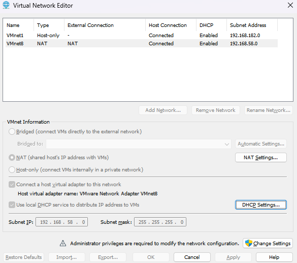
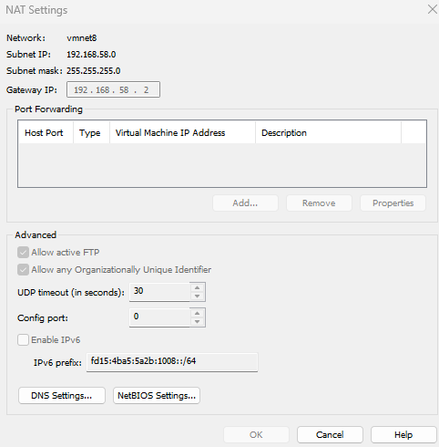
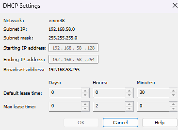
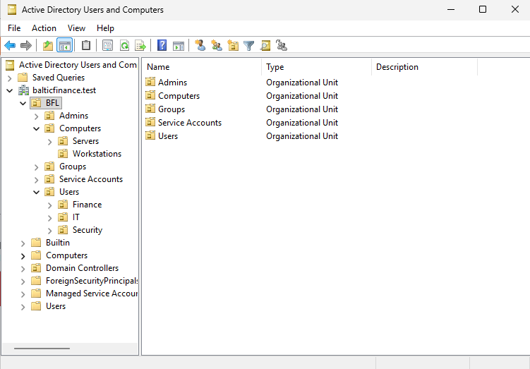
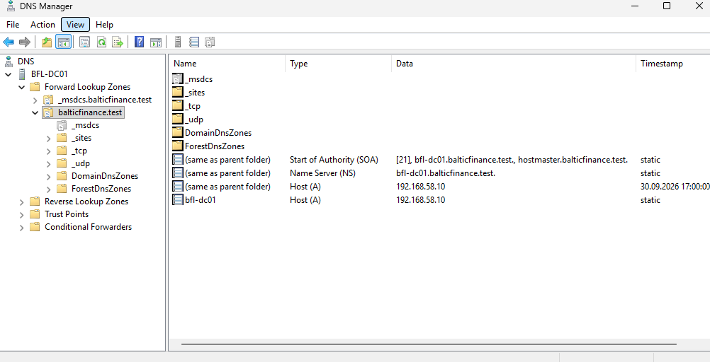
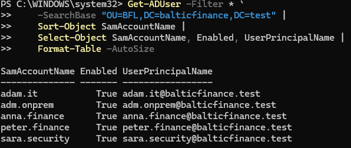
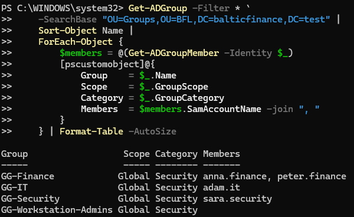

# Day 01 — Active Directory Foundation evidence

All seven screenshots below are uploaded. They document the local VMware network, Active Directory structure, DNS records, users and security groups configured during Day 01.

For executed diagnostics and troubleshooting results, see [console excerpts](console-excerpts.md), the [test record](../../tests/day-01.md), and the [implementation notes](../../docs/day-01.md). Screenshots establish only the configuration visible in each capture.

## 01 — VMware NAT network

**Shows:** VMnet8 configured as NAT, with subnet `192.168.58.0`, mask `255.255.255.0`, the host virtual adapter connected, and VMware DHCP enabled.

**Why it matters:** establishes the network used by BFL-DC01 and the addressing context for the lab. NAT supports outbound connectivity but is not a complete isolation boundary. This screenshot alone does not test connectivity.

## 02 — NAT gateway

**Shows:** VMnet8 gateway `192.168.58.2` and an empty port-forwarding table.

**Why it matters:** documents the default gateway used by BFL-DC01 and confirms that no explicit inbound port-forwarding entries are configured in this VMware NAT view. DNS proxy behavior and outbound access are verified separately in console output.

## 03 — DHCP allocation range

**Shows:** DHCP pool `192.168.58.128–192.168.58.254` on `192.168.58.0/24`.

**Why it matters:** explains the choice of static DC address `192.168.58.10`, which is outside the dynamic pool. This reduces the risk of a DHCP lease using the DC's address; it does not independently prove that no manually configured device could conflict.

## 04 — Organizational unit structure

**Shows:** the `BFL` hierarchy in `balticfinance.test`, including:

- `Users` with `Finance`, `IT`, and `Security`.
- `Computers` with `Workstations` and `Servers`.
- `Admins`, `Service Accounts`, and `Groups`.

**Why it matters:** confirms the organizational layout prepared for future GPO targeting and delegated administration. OU placement alone grants no administrative rights. Accidental-deletion protection is documented through PowerShell output, not this tree view.

## 05 — Domain DNS zones and records

**Shows:** `balticfinance.test` and `_msdcs.balticfinance.test` under Forward Lookup Zones on BFL-DC01. The selected domain zone contains SOA and NS records referencing `bfl-dc01.balticfinance.test`, plus domain-apex and `bfl-dc01` A records pointing to `192.168.58.10`.

**Why it matters:** documents the DNS zones and records supporting the domain. Actual DNS resolution and LDAP SRV lookup were checked separately; this screenshot alone is not a functional DNS test.

## 06 — Enabled lab user accounts

**Shows:** a `Get-ADUser` query beneath the BFL OU returning five enabled accounts:

| Account | User principal name |
|---|---|
| adam.it | adam.it@balticfinance.test |
| adm.onprem | adm.onprem@balticfinance.test |
| anna.finance | anna.finance@balticfinance.test |
| peter.finance | peter.finance@balticfinance.test |
| sara.security | sara.security@balticfinance.test |

**Why it matters:** confirms the accounts exist, are enabled, and use the planned local UPN suffix. The capture does not show individual OU placement, password settings, effective privileges, successful user logon, or Entra synchronization. Those must not be inferred from an enabled account.

## 07 — Security groups and membership

**Shows:** four groups with scope `Global` and category `Security`:

| Group | Direct members shown |
|---|---|
| GG-Finance | anna.finance, peter.finance |
| GG-IT | adam.it |
| GG-Security | sara.security |
| GG-Workstation-Admins | None |

**Why it matters:** confirms department-based membership and that the future workstation-administration group is empty. Naming a group `GG-Workstation-Admins` does not itself assign local administrator rights. Resource permissions and positive/negative authorization tests remain future work.

## Console evidence and limits

[console-excerpts.md](console-excerpts.md) contains selected actual owner-supplied output for network tests, forest/domain properties, services, shares, DNS diagnostics, user configuration, group membership, DC health, activation, and the NTP repair. It is a curated transcript, not a new test run or a Windows event-log export.

The seven screenshots were reviewed in the guided session; no passwords, tokens, or private personal account details were visible. Lab names and private network addresses are intentionally retained.

No Windows client logon, first-logon password change, negative authorization, cross-DC replication, or backup/restore result is established by these images. Publication of evidence does not change the status of unperformed tests.
