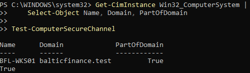
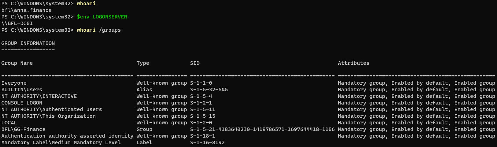
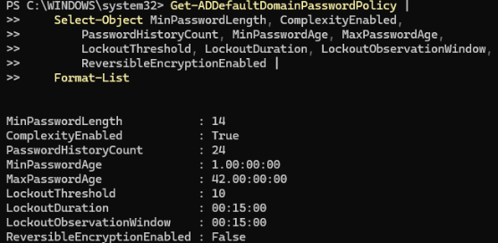
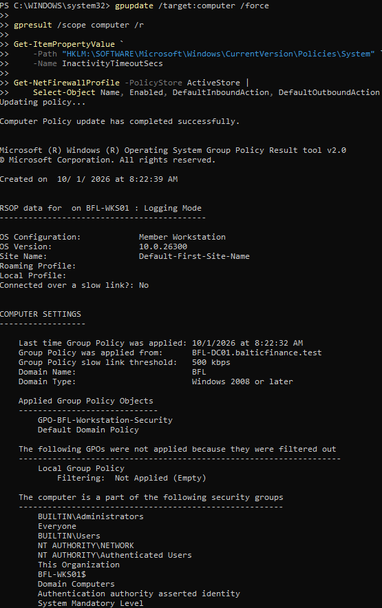
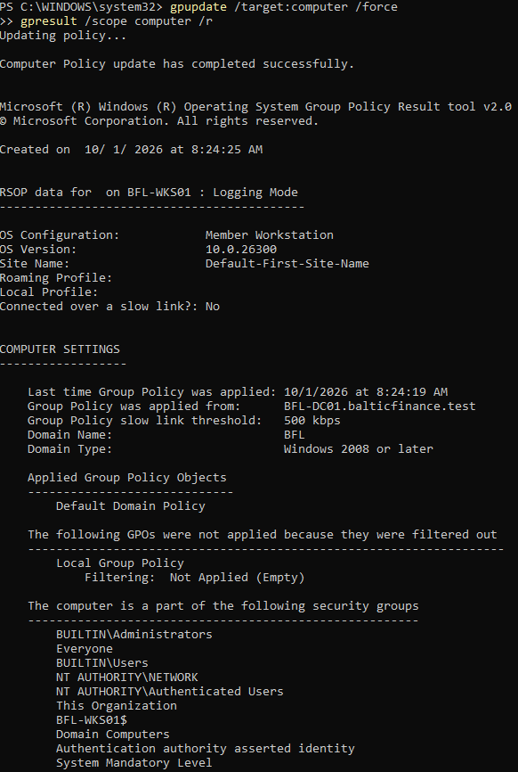
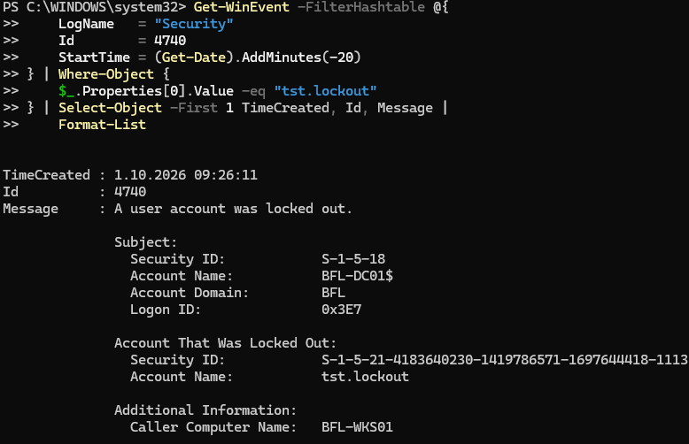
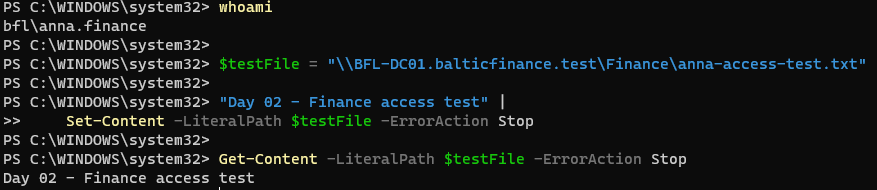
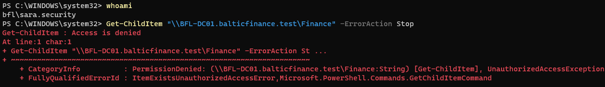
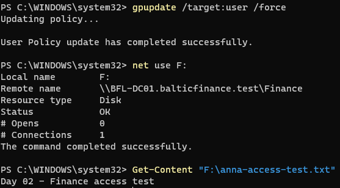
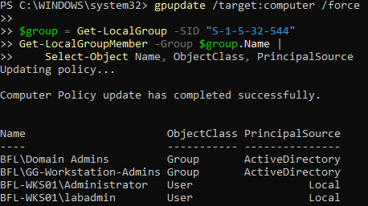

# Day 02 — Evidence

Ten screenshots uploaded by the owner and reviewed during the lab session. Each image supports only the claim stated below.

[Implementation](../../docs/day-02.md) · [Test record](../../tests/day-02.md) · [Console excerpts and observations](console-excerpts.md)

## 01 — Domain join

BFL-WKS01 belongs to balticfinance.test; PartOfDomain and the secure-channel test return True.

## 02 — Domain user session

Anna's identity, BFL-DC01 logon server and GG-Finance membership are visible. The token has medium integrity.

## 03 — Password and lockout policy

Shows minimum length 14, history 24, complexity enabled, threshold 10, 15-minute lockout/window, and reversible encryption disabled. This image records configuration.

## 04 — GPO in scope

GPO-BFL-Workstation-Security appears under Applied Group Policy Objects. The screenshot cuts off before the inactivity and firewall results; those are preserved as text evidence.

## 05 — GPO outside scope

After the temporary move to the parent Computers OU, only Default Domain Policy is listed. This proves scope exclusion, not complete reversal of persistent settings.

## 06 — Account lockout event

Security event 4740 names tst.lockout and caller BFL-WKS01 at 2026-10-01 09:26:11. The owner separately confirmed ten deliberate incorrect attempts; the image alone does not count attempts.

## 07 — Finance access allowed

Anna creates and reads anna-access-test.txt through the Finance UNC path.

## 08 — Finance access denied

Sara's identity and Access is denied when listing Finance demonstrate the negative authorization test.

## 09 — Finance drive mapped

F: points to the expected Finance UNC path with Status OK; the test file is readable. This was captured in Anna's session, but whoami is not visible in this image.

## 10 — Managed local administrator group

GG-Workstation-Admins is present alongside Domain Admins and the two original local accounts after policy refresh. The domain group is empty; this is not proof of an individual user's administrative capability.

## Evidence without additional screenshots

The text record covers firewall and inactivity settings, final computer GPO application, Sara's absent F: mapping, the disabled test account, and share configuration. The 15-minute lock/password requirement and restoration of power timers are owner observations. No EVTX export, packet capture or repaired XML snapshot was supplied. Troubleshooting screenshots were used diagnostically and are not required as extra portfolio evidence.
