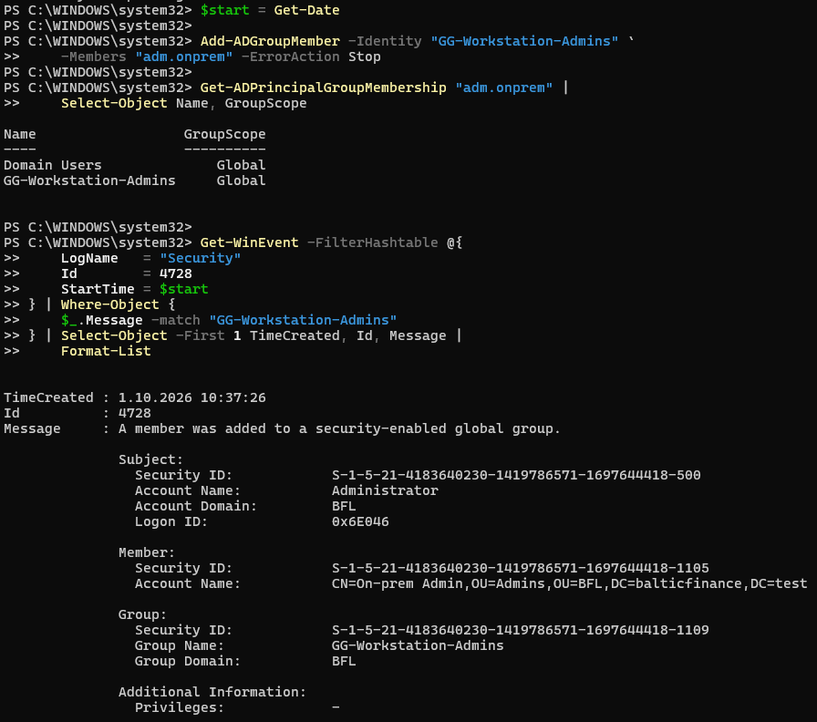
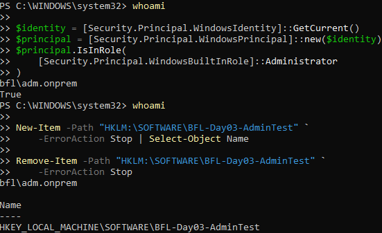
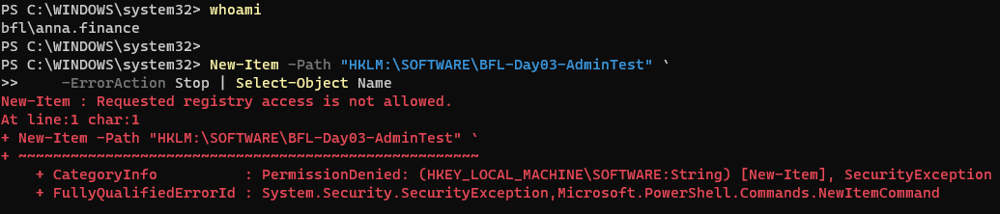
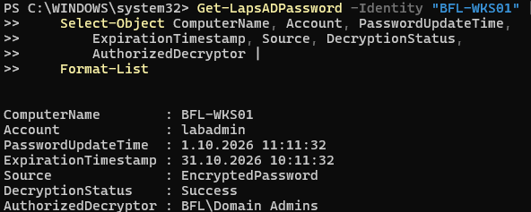
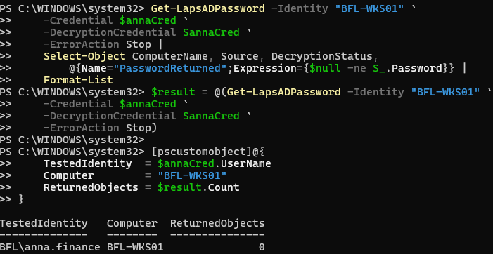
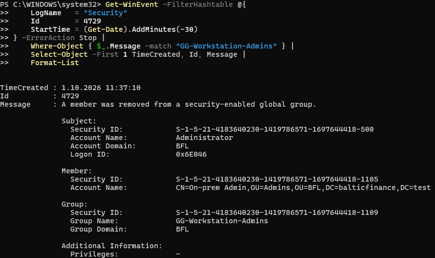
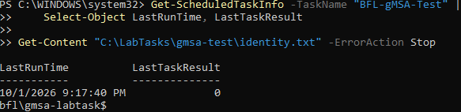

# Day 03 — Evidence

Owner-uploaded screenshots reviewed during the session. Claims are limited to visible output and separately identified text evidence.

[Implementation](../../docs/day-03.md) · [Tests](../../tests/day-03.md) · [Text evidence](console-excerpts.md)

## 01 — Administrator group assignment

Membership in Domain Users and GG-Workstation-Admins, plus event 4728 identifying the actor, member and target group.

## 02 — Administrative operation allowed

bfl\adm.onprem has an elevated administrator token and creates the HKLM test key. The subsequent removal command shows no displayed error.

## 03 — Ordinary-user operation denied

bfl\anna.finance receives PermissionDenied / SecurityException for the same HKLM creation.

## 04 — Encrypted LAPS backup

labadmin password metadata shows EncryptedPassword, successful decryption and BFL\Domain Admins as authorized decryptor. No plaintext password appears.

## 05 — Anna cannot retrieve LAPS data

TestedIdentity=BFL\anna.finance and ReturnedObjects=0. Valid authentication was established by the preceding successful AD computer query recorded in text, not visible here.

## 06 — Group removal audited

Corrected screenshot shows event 4729 at 11:37:10 with On-prem Admin and GG-Workstation-Admins. Restoration of membership was separately verified in console output.

## 07 — Task runs as gMSA

Task result 0 at 21:17:40 and identity.txt containing bfl\gmsa-labtask$ prove the recorded task execution. The screenshot alone does not prove all account permissions.

