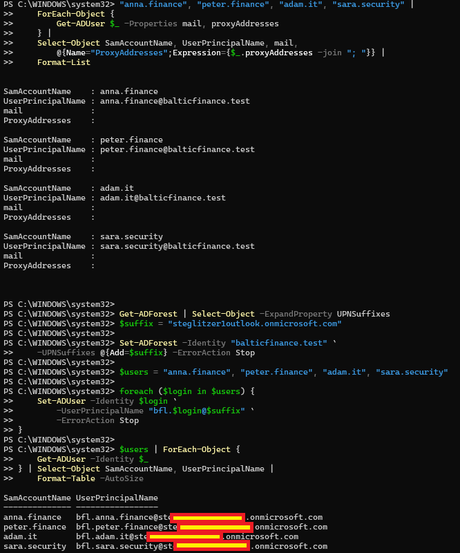
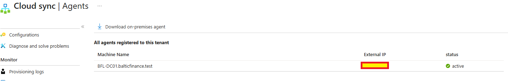
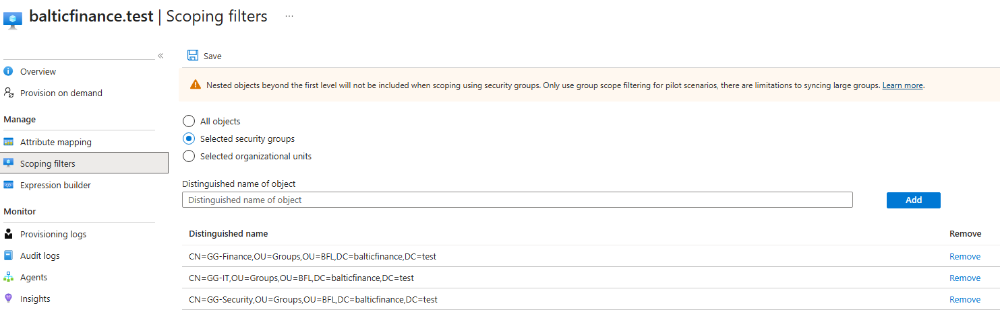
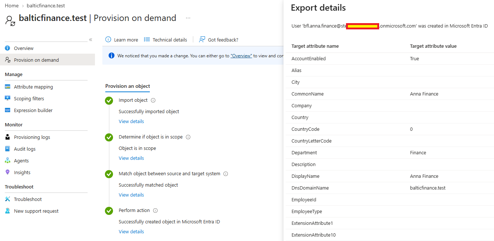
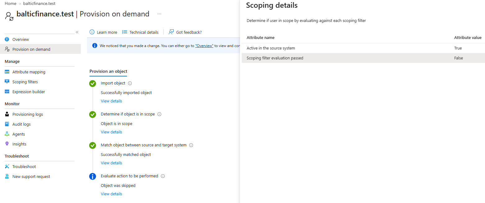
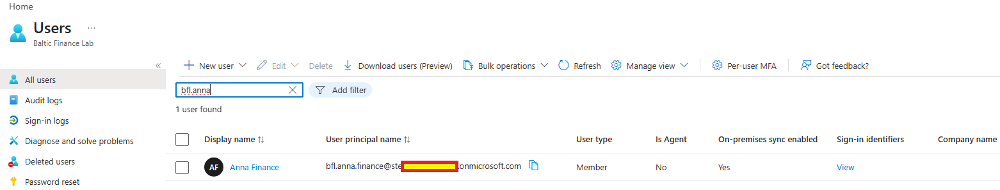

# Day 04 — Evidence

Owner-uploaded screenshots reviewed during the session. Claims are limited to visible output and separately identified text evidence.

[Implementation](../../docs/day-04.md) · [Tests](../../tests/day-04.md) · [Text evidence](console-excerpts.md)

## 01 — UPN preparation

Shows empty mail/proxyAddresses, addition of the tenant suffix and the resulting four bfl.-prefixed UPNs. Portions of the tenant suffix are redacted.

## 02 — New agent active

BFL-DC01.balticfinance.test appears active. Public IP is redacted. Agent health is distinct from completed user synchronization.

## 03 — Pilot group scope

Selected security groups lists the three intended group DNs. The portal warns that nested objects beyond the first level are excluded and that group filtering is for pilot scenarios.

## 04 — Anna created in Entra

On-demand processing succeeds and export details explicitly report the new prefixed Anna account was created. This is an actual provisioning action.

## 05 — Administrator fails scope filter

The corrected uploaded image shows Scoping filter evaluation passed=False and Object was skipped, despite the generic Object is in scope summary. The imported object's GUID was separately resolved to adm.onprem in AD; no universal conclusion is drawn from JoinNotFound alone.

## 06 — Anna has an on-premises source

The prefixed Anna account shows On-premises sync enabled=Yes. Successful login with her AD password was separately owner-confirmed, not shown in this image.

