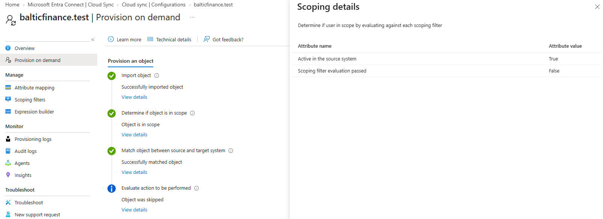
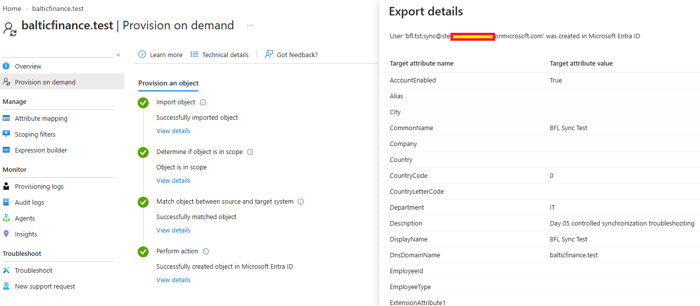
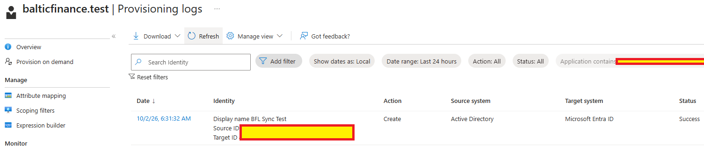

# Day 05 — Evidence inventory

**Session:** 2026-10-02. Three owner-supplied screenshots document the scope issue, correction and successful provisioning. Unnecessary tenant and object identifiers are masked in the images.

## 01 — Initial scope failure

Detailed scoping shows source active=True and filter evaluation=False; the final action was skipped. The generic “Object is in scope” caption is inconsistent with these details. The test identity is established by the session context.

## 02 — Creation after scope correction

Provisioning after adding tst.sync to GG-IT created bfl.tst.sync in Entra ID. Export details show AccountEnabled=True and the expected name, IT department and description.

## 03 — Successful provisioning log

BFL Sync Test has action Create, source Active Directory, target Microsoft Entra ID and status Success. The portal displays 2026-10-02 06:31:32 with local date display selected.

## Supplemental text

[Console and portal excerpts](console-excerpts.md) record retained GG-IT membership, AD Enabled=False, and the subsequent cloud export AccountEnabled=False.

[Implementation](../../docs/day-05.md) · [Tests](../../tests/day-05.md)
