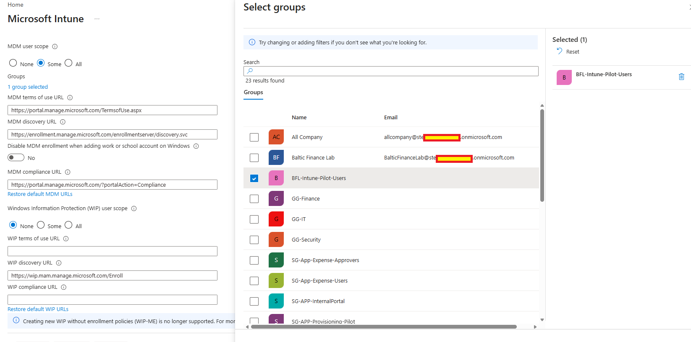
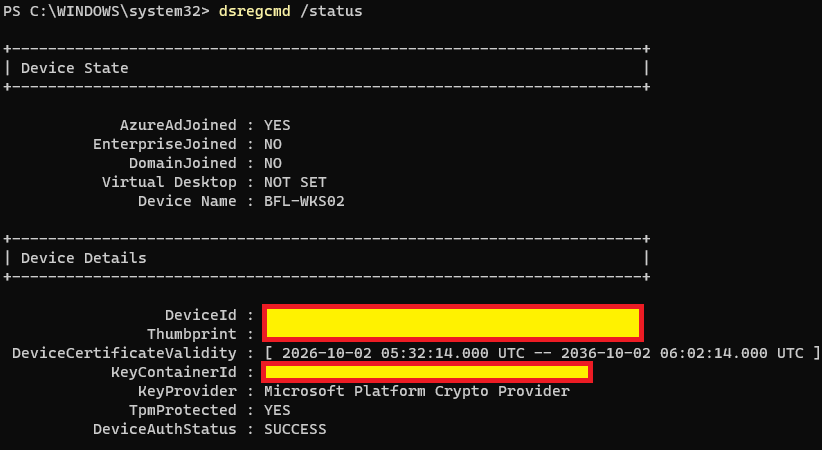
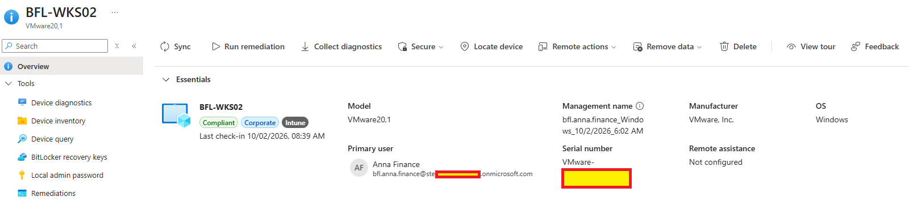

# Day 06 — Evidence inventory

**Session:** 2026-10-02. Three screenshots supplied by the owner and reviewed in the repository. Unnecessary identifiers are masked.

## 01 — Pilot enrollment scope

MDM user scope=Some with BFL-Intune-Pilot-Users selected; WIP scope=None. The group-selection panel is open. Subsequent saving, Anna's membership and license assignment were confirmed by the owner.

## 02 — Final Entra join status

BFL-WKS02 shows AzureAdJoined=YES, DomainJoined=NO, DeviceAuthStatus=SUCCESS and TpmProtected=YES. The SSO section is outside this crop.

## 03 — Intune device overview

BFL-WKS02 is managed by Intune, has Corporate ownership and Anna Finance as primary user. Compliant is the observed portal state; no project compliance policy was tested in Day 06.

## Supplemental session record

[Console excerpts and owner confirmations](console-excerpts.md) distinguish published screenshots from earlier session-only evidence, including AzureAdPrt=YES and the rename/restart sequence.

[Implementation](../../docs/day-06.md) · [Tests](../../tests/day-06.md)
