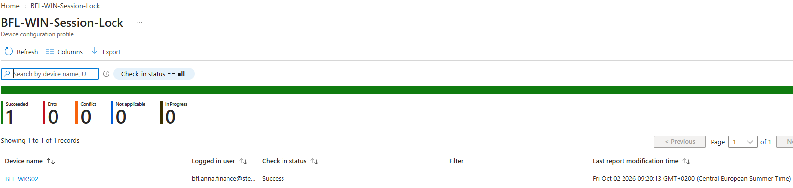
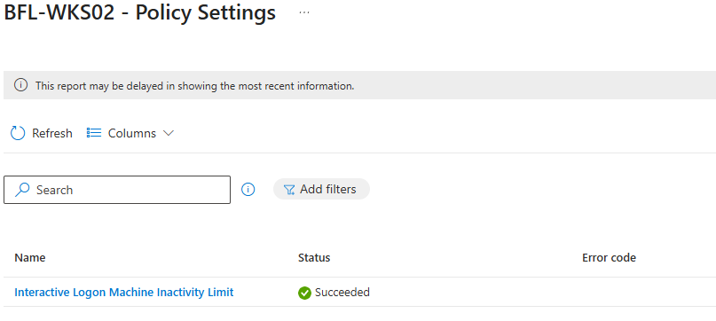
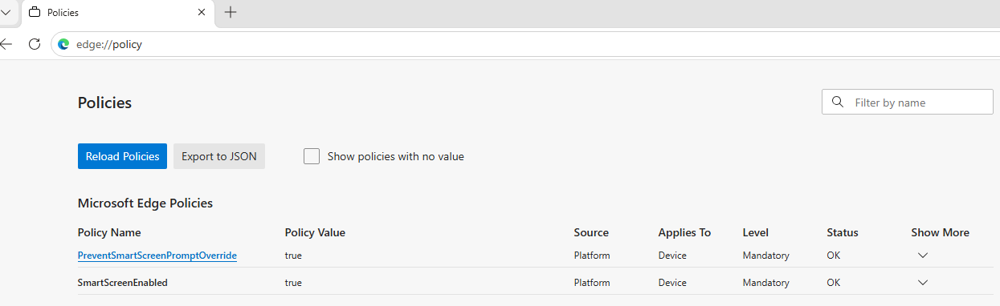
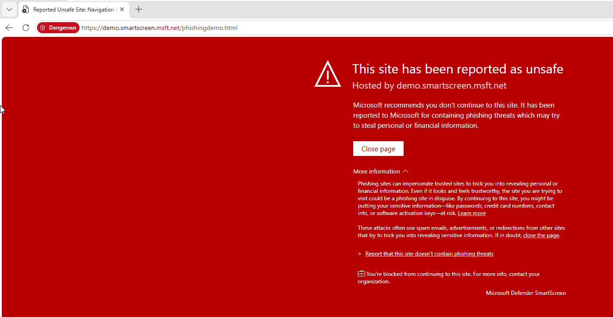
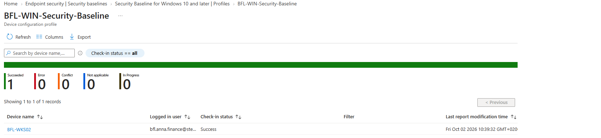

# Day 07 — Evidence inventory

Five owner-supplied screenshots from 2026-10-02, reviewed in the repository.

## 01 — Session-lock profile summary

BFL-WKS02 reports Success, with one successful device and zero reported errors or conflicts. This is not a registry screenshot.

## 02 — Session-lock setting status

Interactive Logon Machine Inactivity Limit reports Succeeded.

## 03 — Edge effective policies

SmartScreenEnabled and PreventSmartScreenPromptOverride are true; source Platform, scope Device, level Mandatory, status OK.

## 04 — Safe demonstration blocked

The Microsoft phishing demonstration produces a SmartScreen warning. Expanded details show that the organization blocks continuation. The owner also confirmed normal browsing worked.

## 05 — Tailored Windows baseline deployment

BFL-WIN-Security-Baseline reports one successful device, BFL-WKS02, and zero errors or conflicts. This aggregate result does not verify each baseline control separately.

## Supplemental evidence

[Session excerpts and confirmations](console-excerpts.md) record the registry value, five-minute behavior test, assignment correction, baseline review and post-restart checks. They distinguish screenshots from owner-confirmed results and unverified steps.

[Implementation](../../docs/day-07.md) · [Tests](../../tests/day-07.md)
