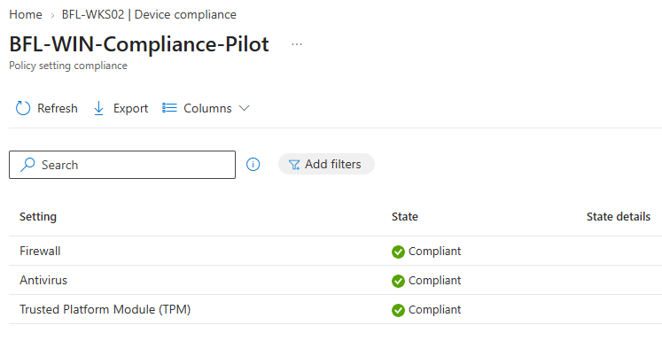
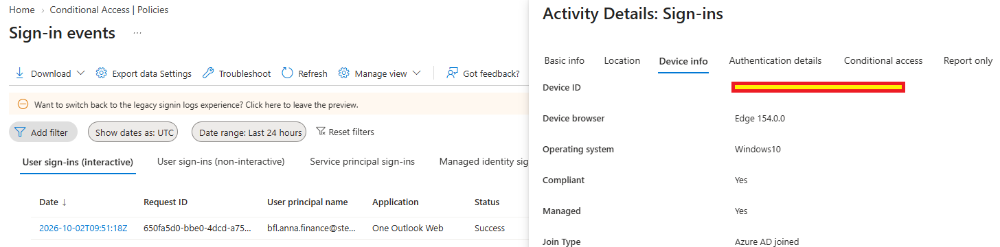
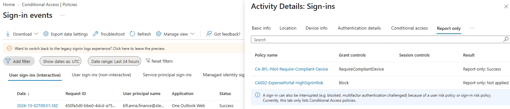
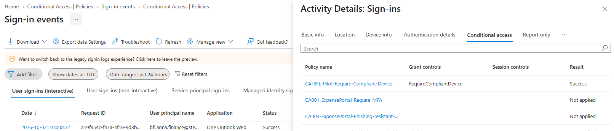
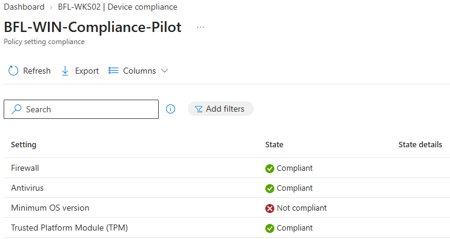
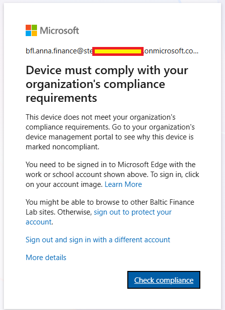
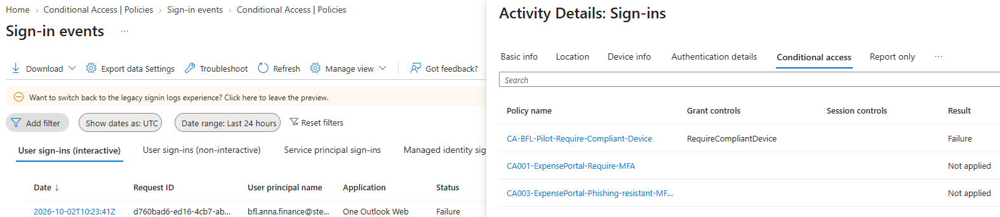
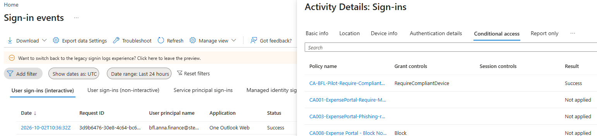

# Day 08 — Evidence inventory

**Session:** 2026-10-02. All eight screenshots below were uploaded by the owner and reviewed against the session record. Sign-in times use UTC.

[Implementation](../../docs/day-08.md) · [Test record](../../tests/day-08.md) · [Owner confirmations and session record](console-excerpts.md)

## 01 — 01-windows-compliance-settings.png

Initial custom-policy results: Firewall, Antivirus and TPM are Compliant.

## 02 — 02-signin-device-compliant.png

Sign-in device context: Compliant Yes, Managed Yes, Azure AD joined. The uploaded image masks the device identifier.

## 03 — 03-ca-report-only-success.png

Report-only evaluation: RequireCompliantDevice returns Report-only: Success for the pilot policy.

## 04 — 04-ca-compliant-access-success.png

Enforced positive test at 10:00:42Z: One Outlook Web and the pilot CA policy both return Success.

## 05 — 05-device-noncompliant-os-version.png

Controlled negative test: Minimum OS version is Not compliant; the other three checks remain Compliant.

## 06 — 06-ca-noncompliant-access-blocked.png

Browser denial: the device must meet the organization's compliance requirements.

## 07 — 07-ca-noncompliant-signin-failure.png

Enforced negative test at 10:23:41Z: One Outlook Web fails and the pilot CA policy returns Failure.

## 08 — 08-ca-access-restored.png

Recovery at 10:36:32Z: One Outlook Web and the pilot CA policy return Success. Final Compliant state and CA On are additionally owner-confirmed.

## Evidence boundaries

Screenshots show effective results, not complete policy definitions or assignments. No full JSON export, emergency-account login test, negative-event Device info pane or final OS-threshold configuration screenshot was supplied. The intermediate synchronization warning is recorded in the session notes; no separate screenshot of it is included here. Owner confirmations are explicitly identified in the accompanying record.
