# Day 09 — Evidence inventory

**Session:** 2026-10-02. All 16 published images were reviewed when preparing this record.

[Implementation](../../docs/day-09.md) · [Tests](../../tests/day-09.md) · [Session excerpts](console-excerpts.md)

Screenshots establish the visible state at capture time. Owner confirmations and untested behavior are identified separately in the test record. No new endpoint tests were run while preparing this documentation.

## 01 — 01-defender-av-policy-status.png

Antivirus policy report: BFL-WKS02 Success, 1 Succeeded, 0 Error and 0 Conflict. The published image contains populated counters, unlike the earlier screenshot in the conversation.

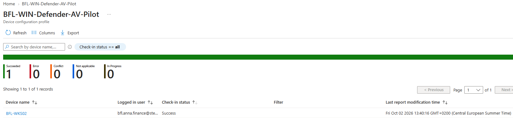

## 02 — 02-defender-quick-scan-result.png

Quick scan completed: 10,852 files, 1 minute 31 seconds, 0 threats; security intelligence shown as up to date.

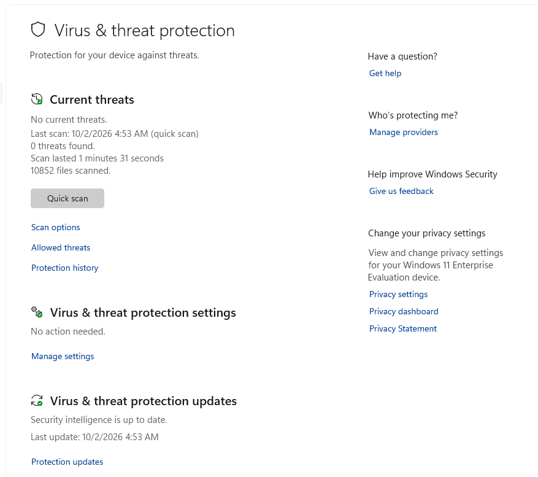

## 03 — 03-defender-eicar-detection.png

Protection history after the EICAR exercise: Threat quarantined, Severe. The collapsed entry does not reveal the precise threat name or file path.

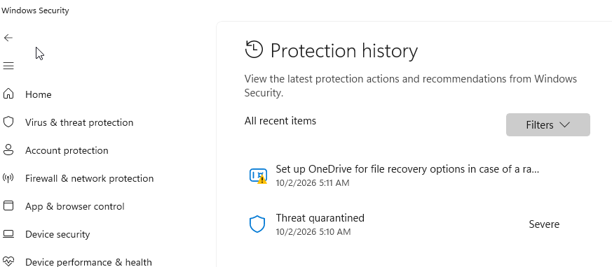

## 04 — 04-firewall-policy-status.png

Firewall policy report: BFL-WKS02 Success, 1 Succeeded, no displayed errors or conflicts.

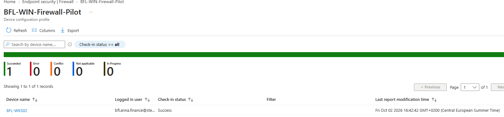

## 05 — 05-firewall-device-status.png

Endpoint firewall: Domain, Private and Public On; Public active.

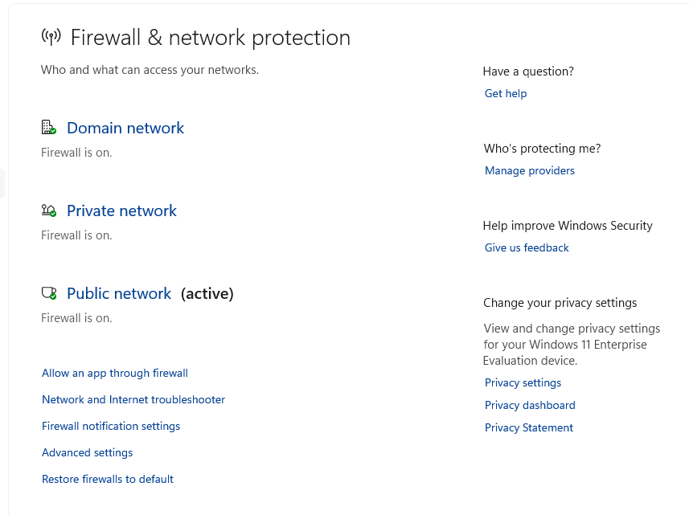

## 06 — 06-firewall-edge-blocked.png

Negative outbound test: Edge cannot load Bing and displays ERR_NETWORK_ACCESS_DENIED.

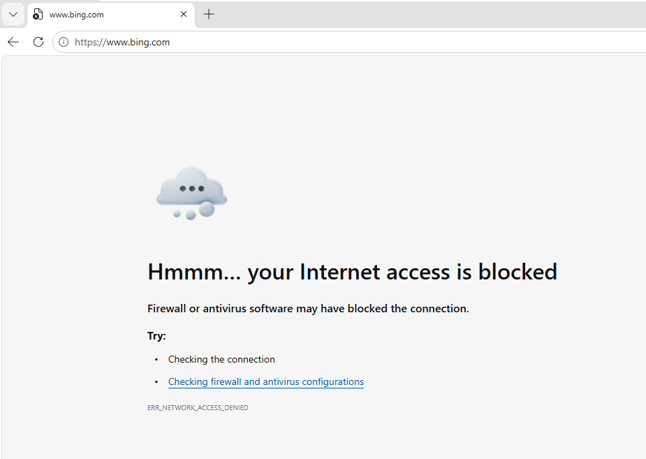

## 07 — 07-firewall-access-restored.png

Recovery test: Bing loads after the temporary Edge block rule was disabled. Outlook recovery is owner-confirmed separately.

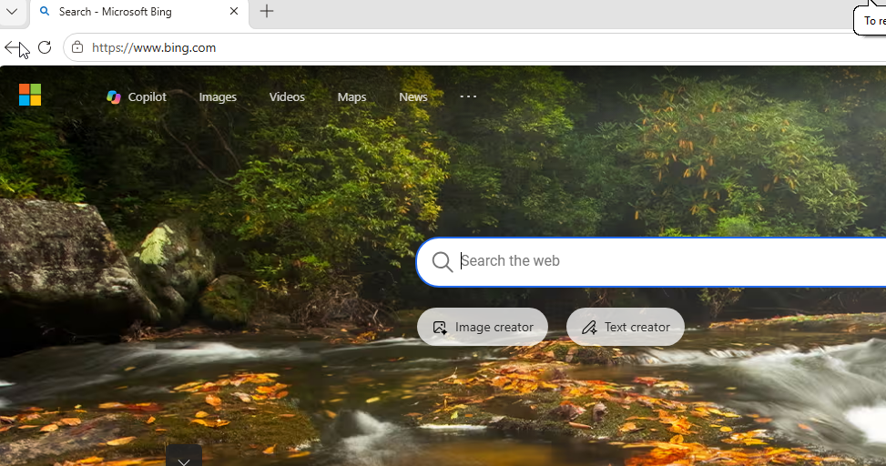

## 08 — 08-bitlocker-policy-status.png

BitLocker policy report: BFL-WKS02 Success. C: remaining BitLocker On is owner-confirmed; this is not a disk-encryption status screenshot.

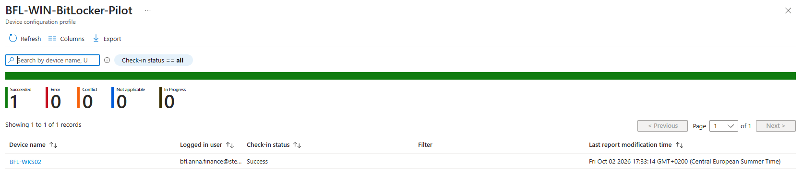

## 09 — 09-asr-audit-policy-status.png

Initial ASR Audit policy report: BFL-WKS02 Success. The later final rule mode is established by the session and block event.

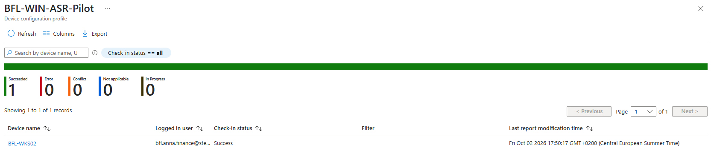

## 10 — 10-asr-audit-event.png

Defender/Operational event 1122: audit of the obfuscated-script rule, with script path and wscript.exe process.

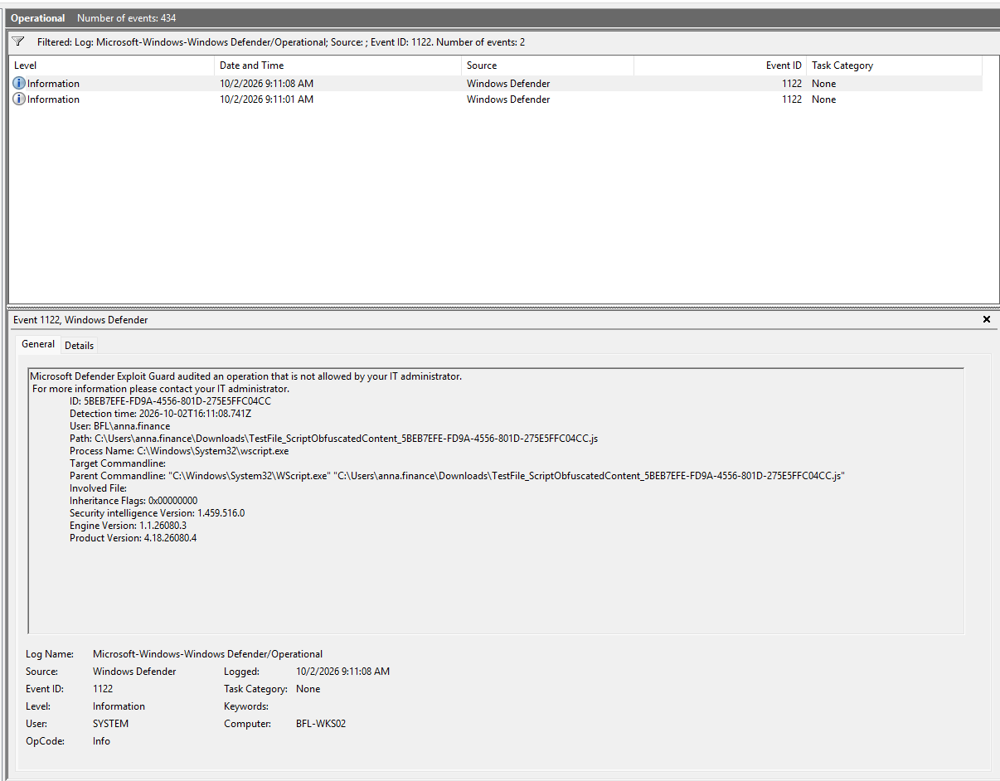

## 11 — 11-asr-block-event.png

Defender/Operational event 1121: blocked operation for the same rule and demonstration script.

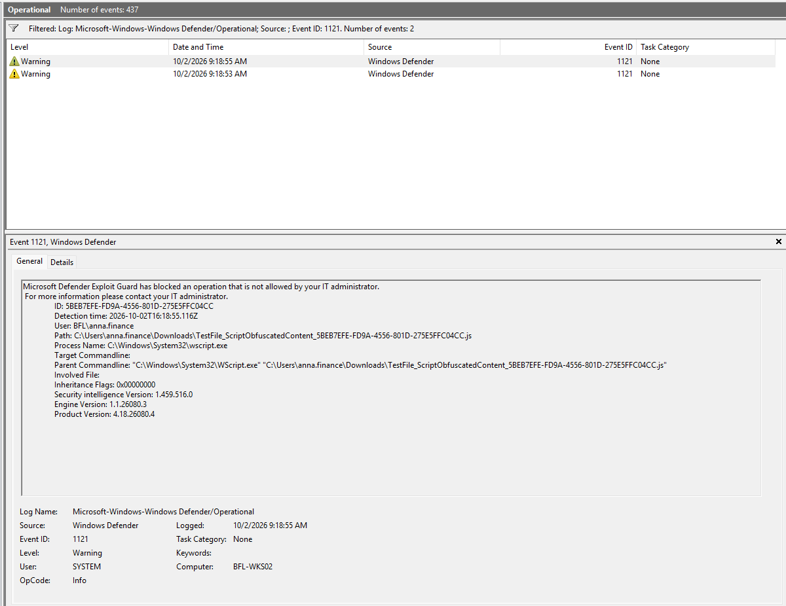

## 12 — 12-mde-onboarding-policy-status.png

MDE onboarding policy report: BFL-WKS02 Success, 1 Succeeded.

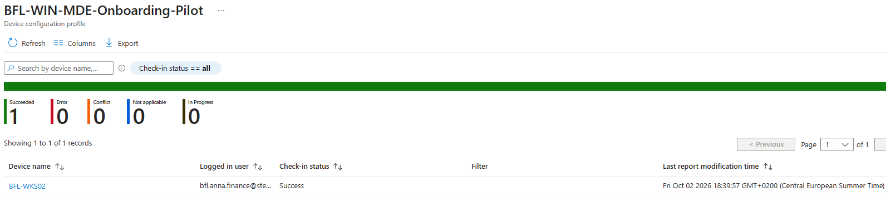

## 13 — 13-mde-device-onboarded.png

Defender device page: Onboarded, Active, Full security operations and AAD joined. Early absence of known risks is not a complete posture assessment.

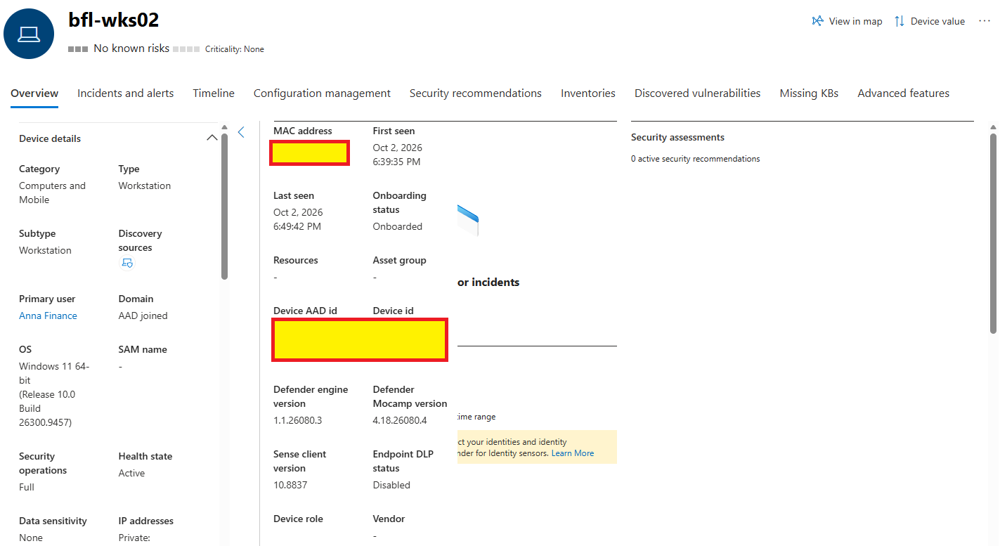

## 14 — 14-tamper-protection-enabled.png

Tamper Protection policy report: BFL-WKS02 Success. Despite the filename, this is the management report; image 15 shows the endpoint setting.

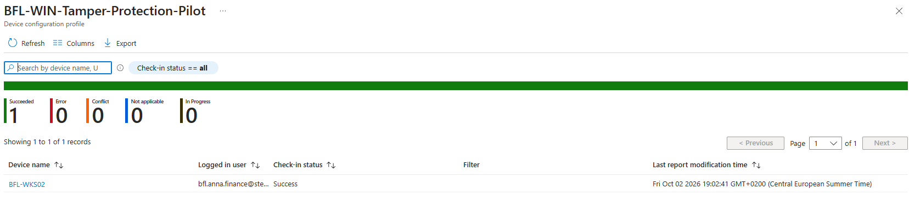

## 15 — 15-tamper-protection-device-status.png

Endpoint Tamper Protection On, greyed out and managed by the administrator. Automatic sample submission is also shown On and managed.

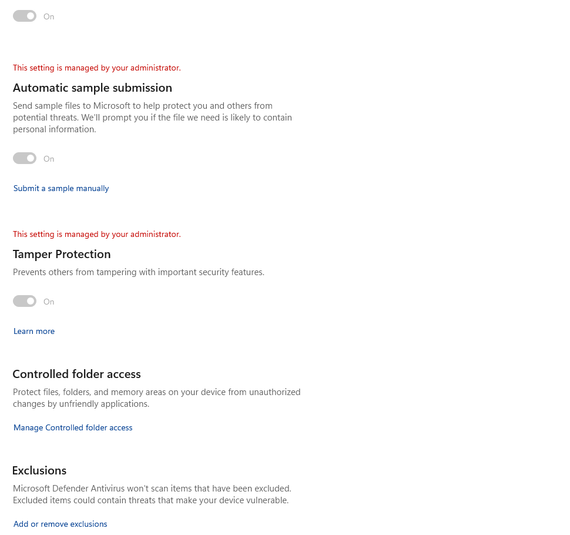

## 16 — 16-bitlocker-key-rotation-status.png

BitLocker key rotation action Complete; device Compliant. The new key identifier and C: remaining On were separately confirmed by the owner; recovery-password values are not shown.

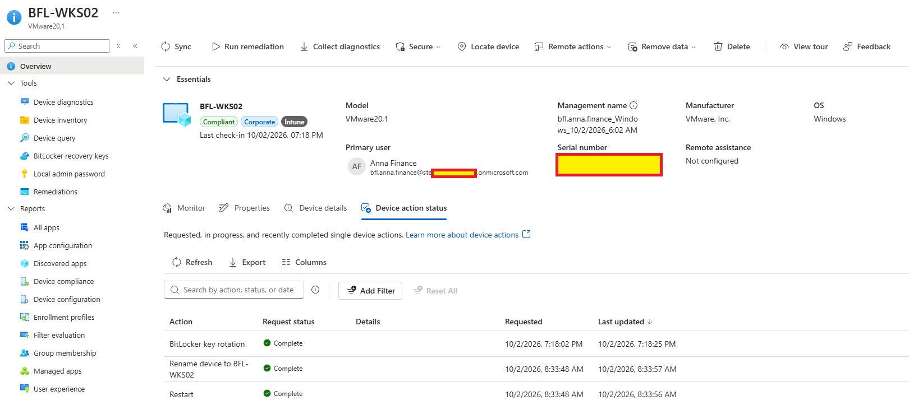

## Evidence handling

The images are the owner's existing uploads and were not modified during this documentation update. Do not publish recovery passwords, tokens or raw onboarding packages. Guest UI times and portal times are not assumed to share a timezone; ASR excerpts use the UTC detection timestamps embedded in the events. This inventory does not claim an exported EVTX, full policy export or firewall log was collected.
