# Day 10 — Evidence inventory

**Session:** 2026-10-02. All 13 published screenshots were reviewed for this record.

[Implementation](../../docs/day-10.md) · [Tests](../../tests/day-10.md) · [Session excerpts](console-excerpts.md)

Screenshots are the owner's existing uploads. They show the state at capture time; owner confirmations and evidence limits are identified separately.

## 01 — 01-rbac-reader-assignment.png

Corrected active Reader assignment for Anna Finance on rg-bfl-rbac-lab. Current role assignments shows one role at This resource.

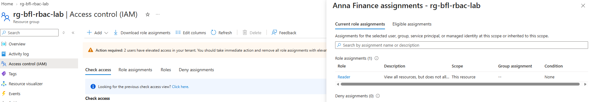

## 02 — 02-rbac-reader-view.png

Resource-group Overview is visible during Anna's Reader test; subscription, Poland Central and lab tags are shown.

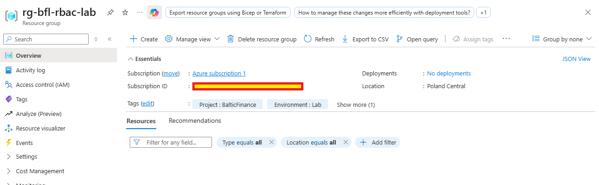

## 03 — 03-rbac-reader-write-denied.png

Actual tag-save attempt with RbacTest=ReaderAttempt fails with AuthorizationFailed.

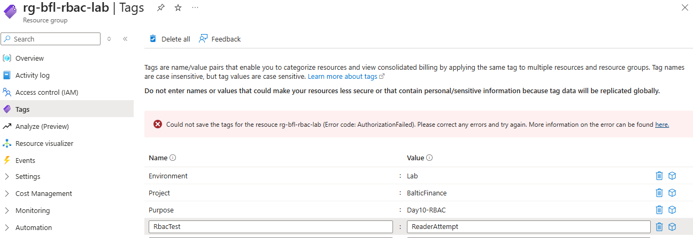

## 04 — 04-rbac-contributor-write-success.png

RbacTest=ContributorAllowed appears in the resulting tag list after the Contributor write test.

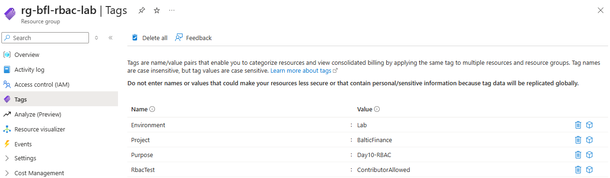

## 05 — 05-rbac-contributor-role-assignment-denied.png

Anna has active Reader and Contributor on the group. Add role assignment and Add custom role are disabled. This is UI evidence, not an API-denial record.

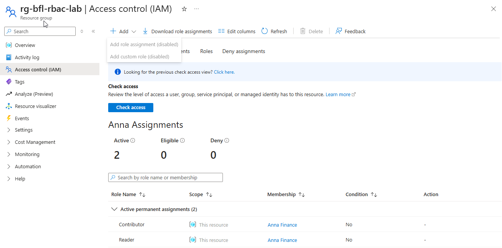

## 06 — 06-rbac-security-reader-assignment.png

Corrected active Security Reader assignment on Azure subscription 1. This resource refers to the subscription in this image.

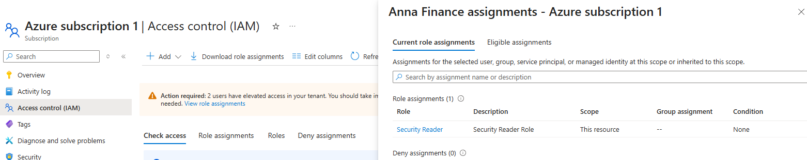

## 07 — 07-rbac-security-reader-view.png

Anna's Defender for Cloud Recommendations view for Azure subscription 1. Existing resource recommendations are visible; rows are Not evaluated.

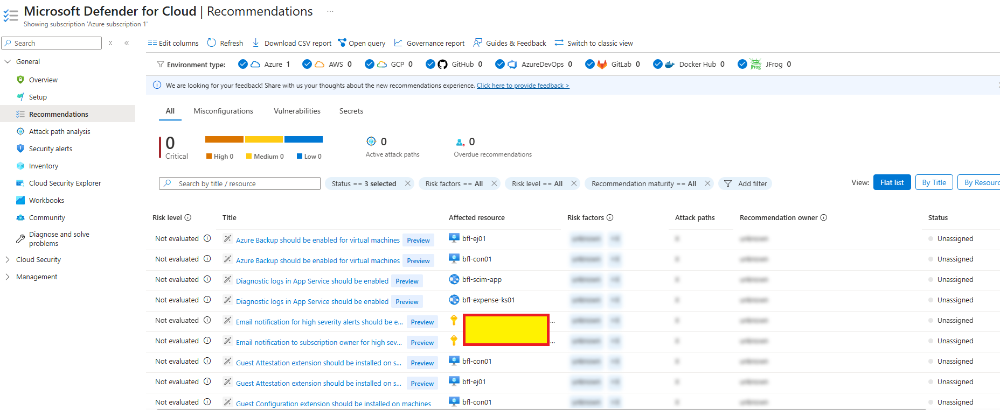

## 08 — 08-rbac-security-reader-write-denied.png

Tag-save attempt with RbacTest=SecurityReaderAttempt fails with AuthorizationFailed after Contributor removal. This is not a Defender-settings write test.

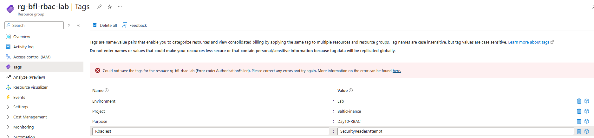

## 09 — 09-rbac-blob-read-denied.png

Microsoft Entra user authentication selected; blob listing denied before Anna receives a data role. The empty list does not prove an empty container.

## 10 — 10-rbac-blob-read-success.png

Microsoft Entra authentication, rbac-test.txt listed as a 34-byte Hot block blob, and browser download visible. File contents were confirmed separately by the owner.

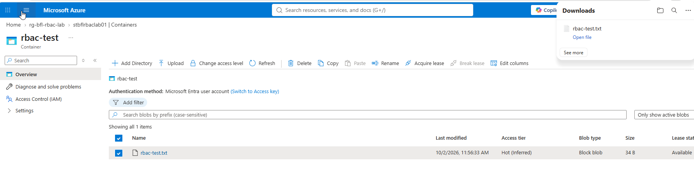

## 11 — 11-rbac-blob-write-denied.png

Upload of anna-upload-test.txt rejected as unauthorized; rbac-test.txt remains visible.

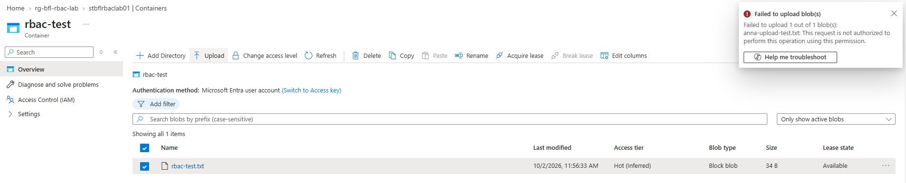

## 12 — 12-rbac-blob-access-revoked.png

Blob listing denied again after removal of Anna's Storage Blob Data Reader; Microsoft Entra authentication remains selected.

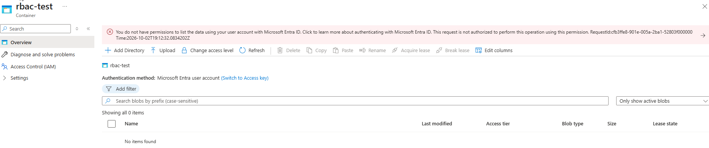

## 13 — 13-rbac-lab-cleanup.png

Final resource-group inventory no longer contains rg-bfl-rbac-lab. Existing groups remain visible. Security Reader removal was separately owner-confirmed.

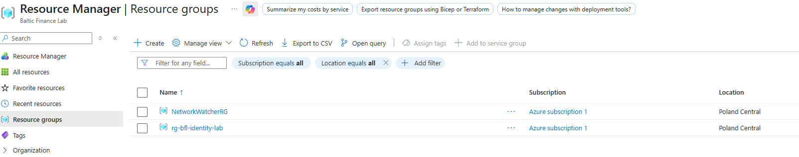

## Evidence handling

No credentials, keys or SAS tokens are transcribed. Published images were preserved unchanged. The record does not claim that a full account configuration export, Activity Log export or storage diagnostic log was collected. UTC timestamps in denial banners are transcribed only where useful; other UI timestamps are not assigned an assumed timezone.
