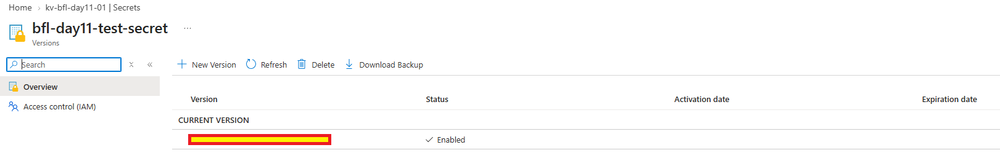
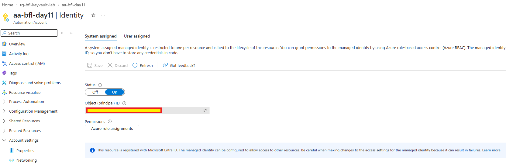
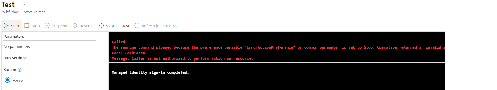
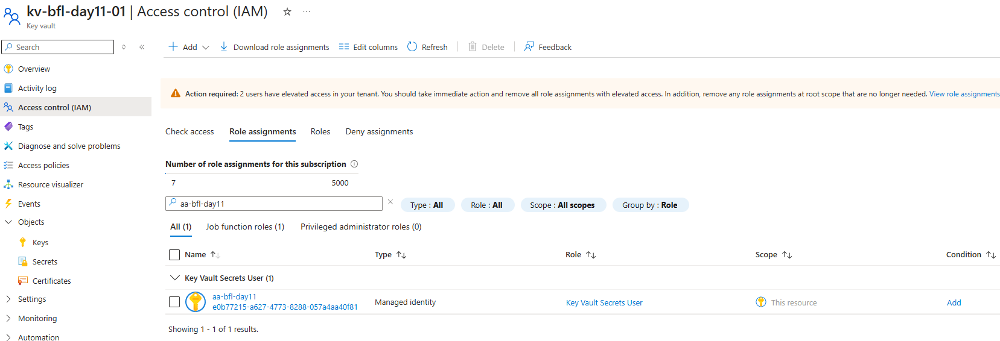
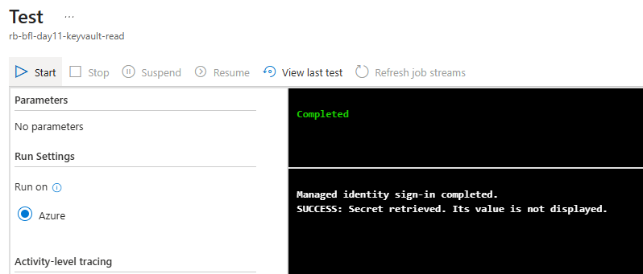
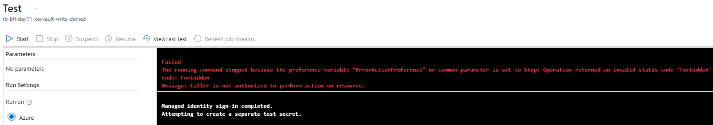
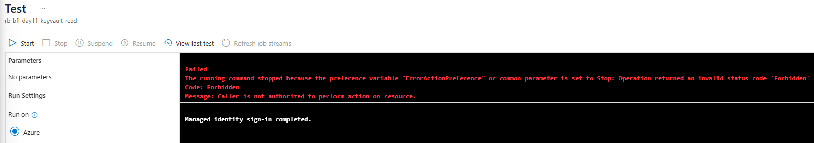

# Day 11 — Evidence inventory

Seven screenshots were supplied by the owner, reviewed in the session and confirmed present in this repository. Images show capture-time observations; they are not a live environment audit.

[Implementation](../../docs/day-11.md) · [Tests](../../tests/day-11.md) · [Session excerpts](console-excerpts.md)

## 01 — 01-keyvault-test-secret.png

An Enabled current version of bfl-day11-test-secret in kv-bfl-day11-01. The secret value is not displayed.

## 02 — 02-automation-managed-identity.png

aa-bfl-day11 Identity page with System assigned Status On.

## 03 — 03-keyvault-read-denied.png

Initial read runbook: managed-identity sign-in completed, then Forbidden because the caller is not authorized.

## 04 — 04-keyvault-secrets-user-assignment.png

Key Vault Secrets User assigned to aa-bfl-day11, type Managed identity, scope This resource on kv-bfl-day11-01.

## 05 — 05-keyvault-read-success.png

Read runbook Completed after role assignment. The success marker confirms retrieval without printing the secret value.

## 06 — 06-keyvault-write-denied.png

Write-negative runbook: sign-in and separate-secret creation attempt markers, followed by Forbidden.

## 07 — 07-keyvault-access-revoked.png

Read runbook after role removal: sign-in succeeds, but secret retrieval is Forbidden again.

## Evidence handling

The owner's uploaded images are preserved unchanged. No secret values or authentication tokens are transcribed. The documentation does not reproduce tenant, subscription or principal identifiers. Runbook source is recorded from the supplied instructions, separately from the observed output. Exact test timestamps are not visible; documentation was updated on 2026-10-05.
