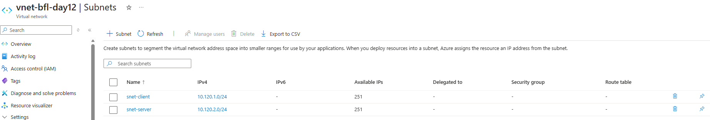
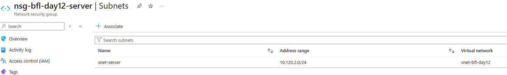
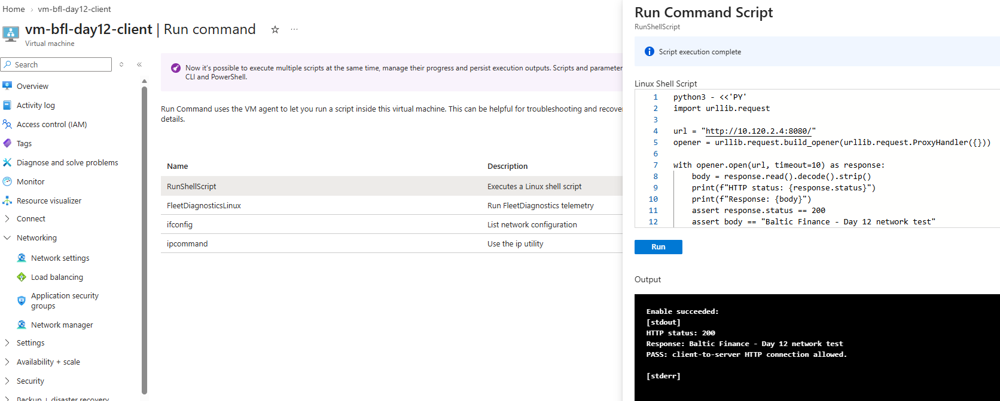
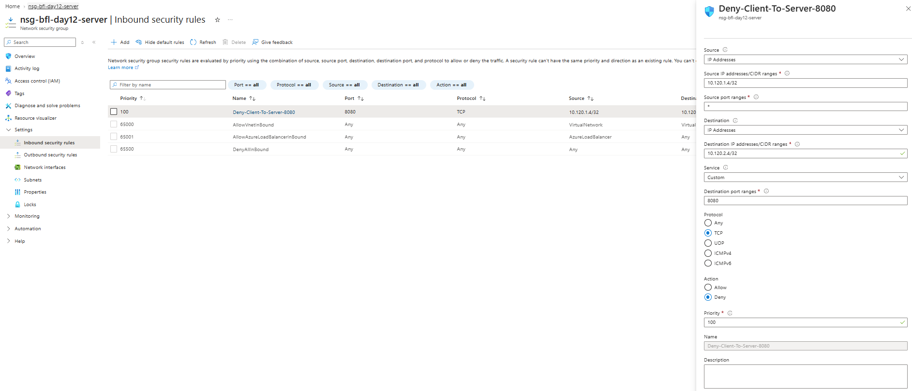
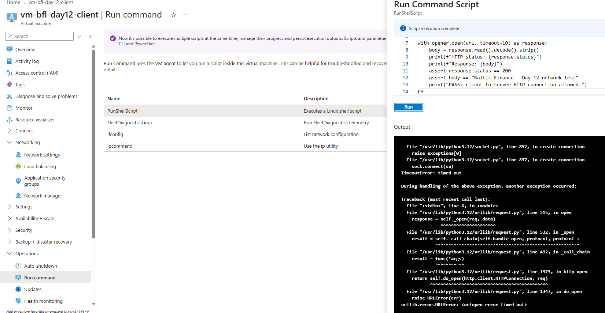
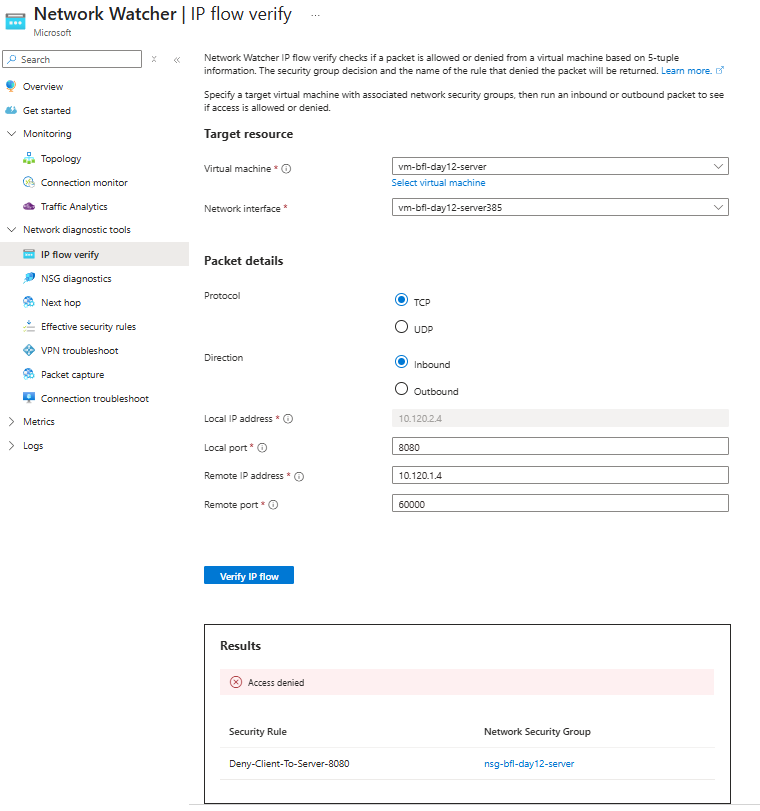
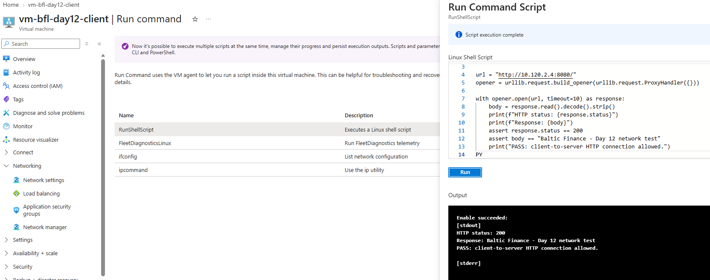
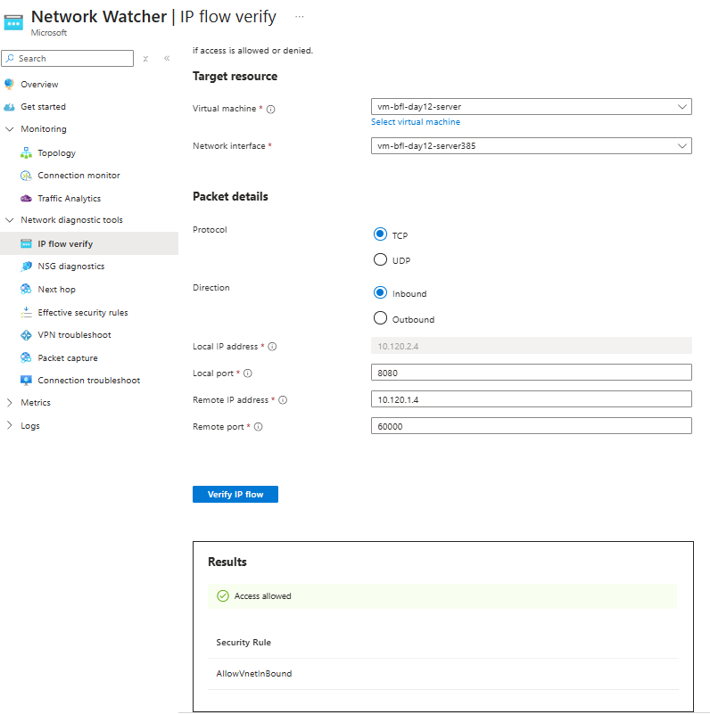

# Day 12 — Evidence inventory

**Session:** 2026-10-05. Eight screenshots were reviewed in the session and confirmed present in the repository.

[Implementation](../../docs/day-12.md) · [Tests](../../tests/day-12.md) · [Session excerpts](console-excerpts.md)

## 01 — 01-vnet-subnets.png

Final VNet Subnets view: snet-client 10.120.1.0/24 and snet-server 10.120.2.0/24. This replaces the earlier deployment/Overview captures.

## 02 — 02-nsg-subnet-association.png

nsg-bfl-day12-server associated with snet-server 10.120.2.0/24 in vnet-bfl-day12.

## 03 — 03-client-server-allowed.png

Client Run Command returns HTTP 200, the expected demonstration text and PASS before the custom deny rule.

## 04 — 04-nsg-deny-rule.png

Custom inbound Deny-Client-To-Server-8080: TCP, source 10.120.1.4/32, destination 10.120.2.4/32, source port *, destination 8080, priority 100.

## 05 — 05-client-server-blocked.png

Repeated client request fails with TimeoutError and URLError after the deny rule is added.

## 06 — 06-ip-flow-denied.png

Server inbound TCP rule evaluation returns Access denied and identifies Deny-Client-To-Server-8080 in nsg-bfl-day12-server.

## 07 — 07-client-server-restored.png

After removal of the deny rule, the same client request again returns HTTP 200, expected content and PASS.

## 08 — 08-ip-flow-allowed.png

Repeated server inbound TCP rule evaluation returns Access allowed through AllowVnetInBound.

## Evidence boundaries

Images are preserved as uploaded by the owner. The HTTP tests and Network Watcher evaluations are different evidence types. Port 60000 in IP flow verify was a chosen diagnostic source port, not an observed HTTP source port.

The server listener output, VM private-address confirmations and final Stopped (deallocated) state are recorded separately as supplied output or owner confirmations. No screenshot independently verifies the corrected final client NIC NSG settings or final VM power state. Private keys, public IP values, subscription identifiers and contact details are not transcribed into this documentation.
