# Day 13 — Evidence inventory

Fourteen owner-supplied screenshots are published. They document a Storage network remediation, successful managed-identity reads and a workstation denial. Defender reassessment remains pending.

[Implementation](../../docs/day-13.md) · [Tests](../../tests/day-13.md) · [Actual output excerpts](console-excerpts.md)

## 01 — 01-defender-plans.png

Defender CSPM On with Partial coverage; Foundational CSPM Full. Visible workload plans are Off.

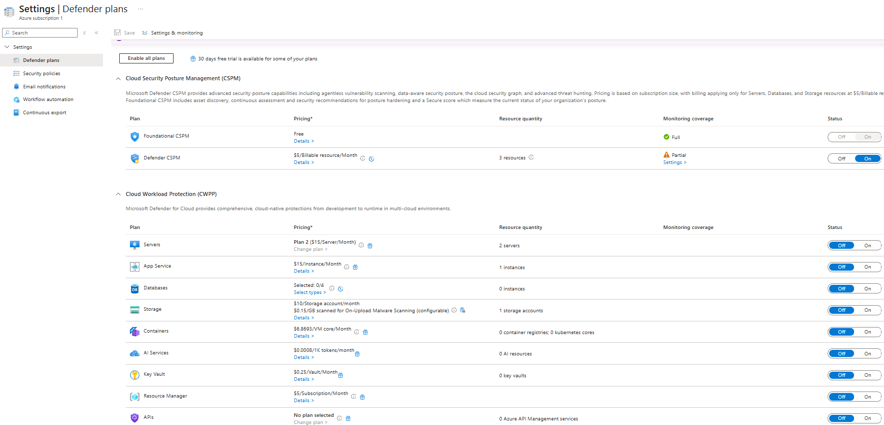

## 02 — 02-recommendations-before.png

Initial recommendation inventory; risk Not evaluated and governance status Unassigned are visible.

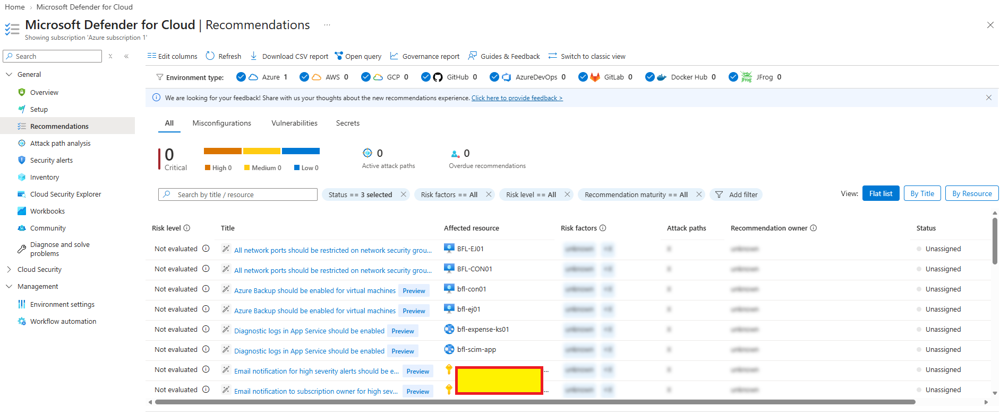

## 03 — 03-secure-score-before.png

Saved baseline: Secure Score 34%, 14/32 active recommendations, zero displayed attack paths. Not a post-remediation score.

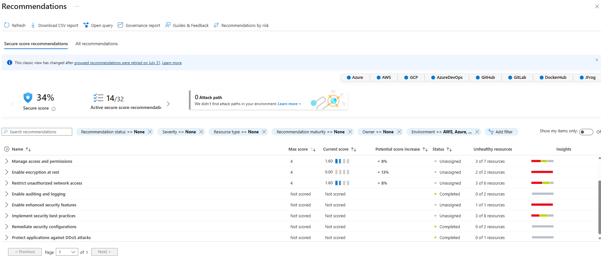

## 04 — 04-storage-network-before.png

Initial Storage access enabled from all networks.

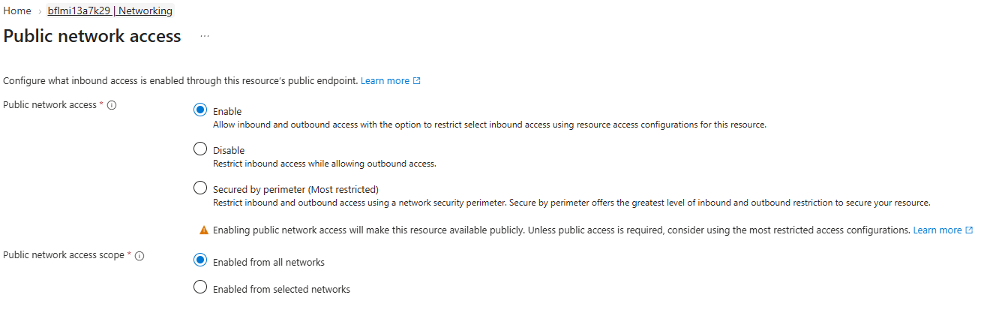

## 05 — 05-storage-network-after.png

Intermediate selected-networks configuration: one IPv4 allow rule, one exception, no VNet yet. Superseded by 13.

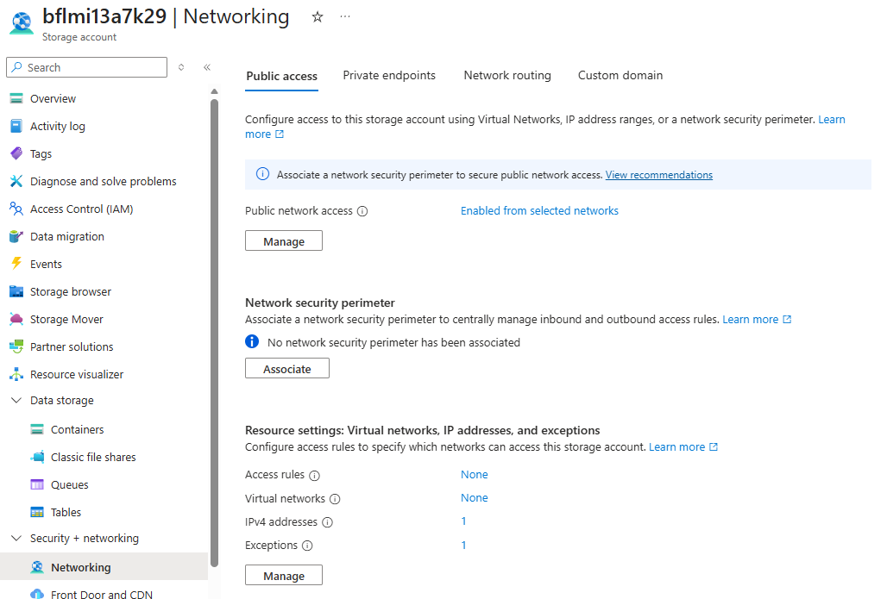

## 06 — 06-storage-access-allowed.png

Workstation Storage browser lists the existing 205-byte blob using Access key authentication.

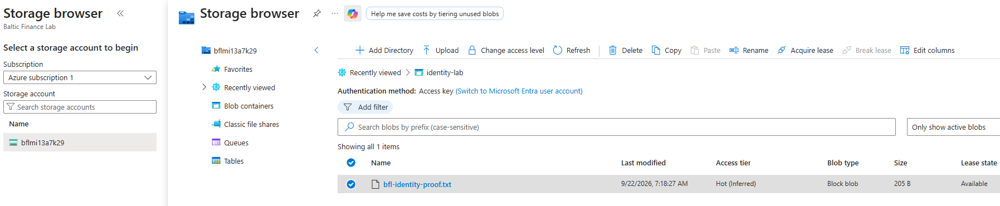

## 07 — 07-storage-recommendation-details.png

Medium-severity VNet-rules recommendation and remediation instructions; one affected account.

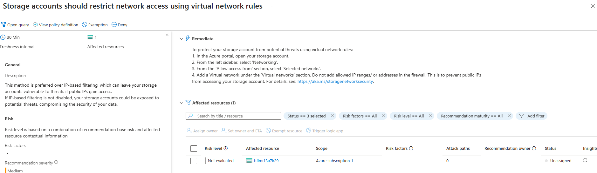

## 08 — 08-storage-vnet-rule.png

vnet-bfl-day12 / snet-client allowed; service endpoint status Enabled.

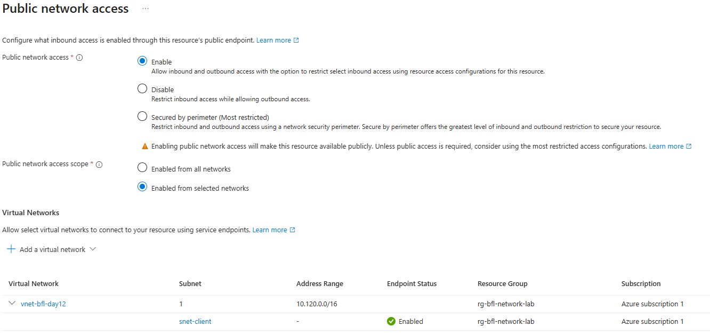

## 09 — 09-storage-blob-reader-assignment.png

Client VM managed identity has Storage Blob Data Reader at identity-lab container scope (This resource).

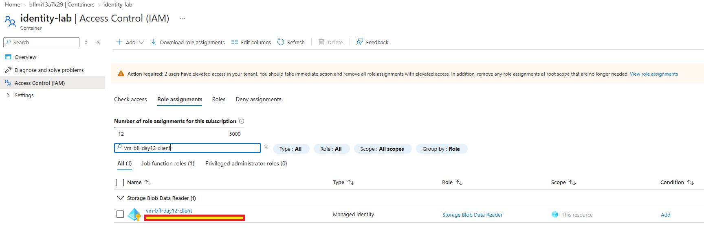

## 10 — 10-storage-vm-access-allowed.png

VM token acquisition and Blob GET: HTTP 200, 205 bytes, PASS before workstation IP-rule removal.

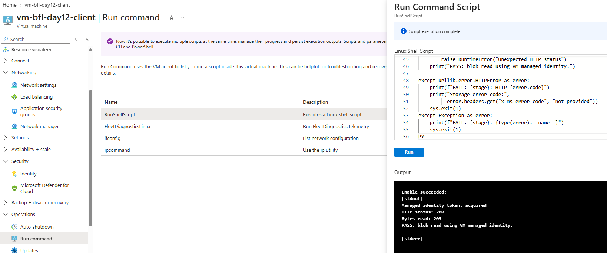

## 11 — 11-storage-vm-access-after-ip-removal.png

Repeated VM GET after IP-rule removal: HTTP 200, 205 bytes, PASS.

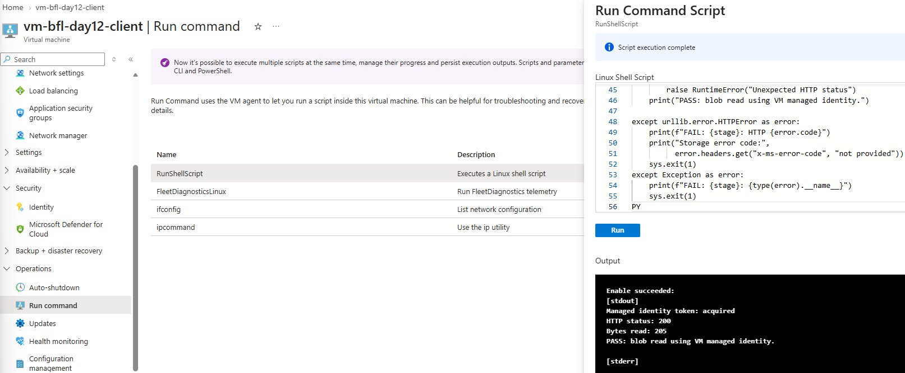

## 12 — 12-storage-public-access-blocked.png

Workstation portal container request returns 403. Networking is identified as a possible cause; authentication selector is not shown.

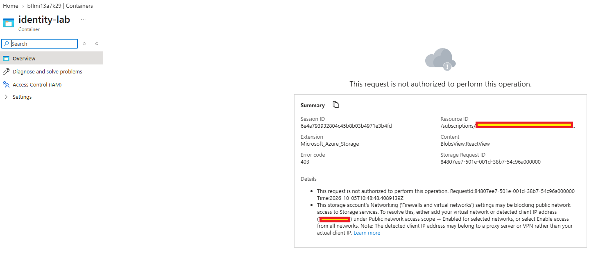

## 13 — 13-storage-network-final.png

Final summary: selected networks, one VNet, no IPv4 allow rules and one retained exception.

## 14 — 14-storage-recommendation-pending.png

Account still listed after functional tests; no successful Defender reassessment is claimed.

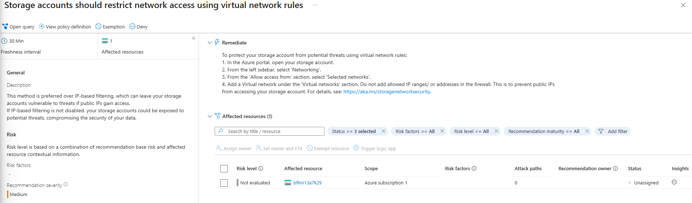

## Reading the sequence

Screenshots 05–06 capture an intermediate IP-allowlisted state. Screenshot 08 adds the subnet rule, 09 establishes the container role assignment, 10–11 show actual VM reads, and 12–13 show the workstation denial and final network configuration. Screenshot 14 preserves the outstanding assessment rather than claiming that the finding is resolved.

The 34% Secure Score screenshot is a baseline only. No later score, private-link deployment, write-denial test or resource deletion is evidenced. Client deallocation is an owner confirmation recorded in the output notes, not one of these screenshots.

Public endpoint network restriction does not imply anonymous data access was enabled before the change, or that the public endpoint is now disabled. A trusted-services exception remains.

Keep tokens, keys, SAS URLs, unnecessary identifiers and personal information out of future evidence.
