# Day 14 — Evidence inventory

**Session:** 2026-10-05. Twelve screenshots document Azure Activity ingestion, KQL validation, Sentinel detection and incident resolution.

[Implementation and queries](../../docs/day-14.md) · [Tests](../../tests/day-14.md) · [Observed output](console-excerpts.md)

## 01 — Sentinel workspace in North Europe

law-bfl-sentinel is listed under Microsoft Sentinel in rg-bfl-sentinel-lab, North Europe. This is the final workspace after the regional onboarding obstacles.

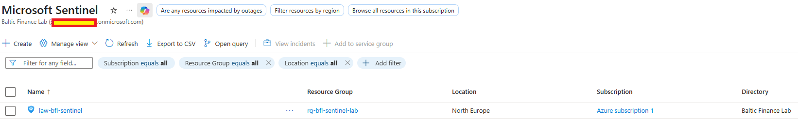

## 02 — Subscription-level collection policy

BFL-Day14-AzureActivity is assigned at Azure subscription 1 scope. Parameters show DeployIfNotExists and Enable logs True. The destination workspace was identified in the owner-supplied creation summary; its full path is truncated in this view.

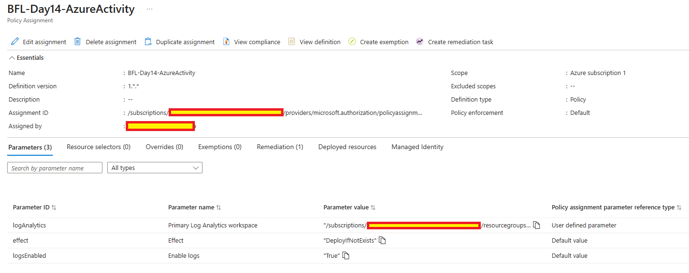

## 03 — Remediation completed

The remediation task shows Complete and 1 out of 1 remediated resources. This confirms deployment execution; ingestion is verified separately in 04.

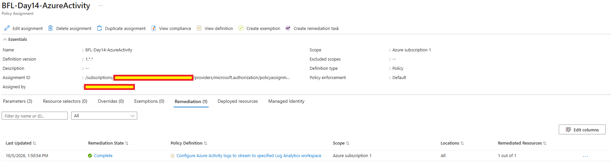

## 04 — First ingested events

AzureActivity summary returns 5 events, from 11:49:58.541 to 11:54:03.394 UTC. The original uploaded filename is preserved. Subsequent inspection identified these as correlated policy/deployment events.

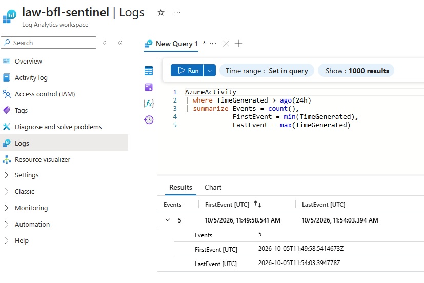

## 05 — Initial tag-write operation

The correlation-filtered query shows TAGS/WRITE Start and Success at 12:06:58.796 and 12:06:59.062 UTC. ResourceId is not populated in the displayed result; the target is established by the later _ResourceId query.

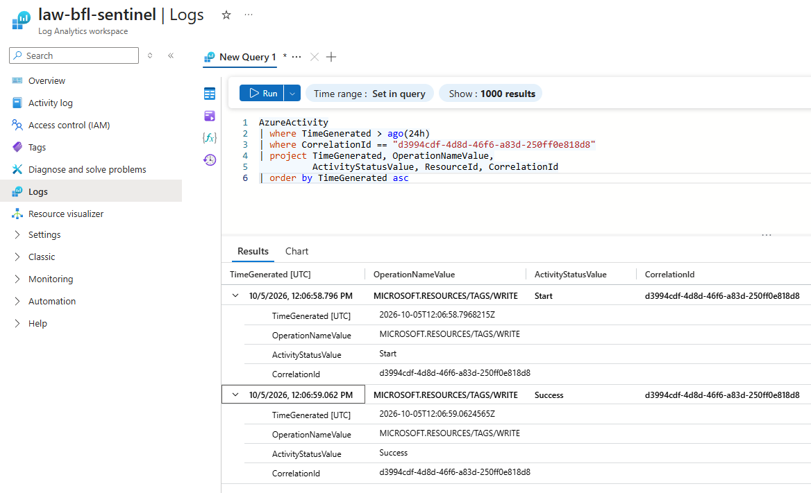

## 06 — Resource-scoped detection query

The query uses _ResourceId to restrict successful TAGS/WRITE operations to law-bfl-sentinel. It returns the initial test event and its correlation ID.

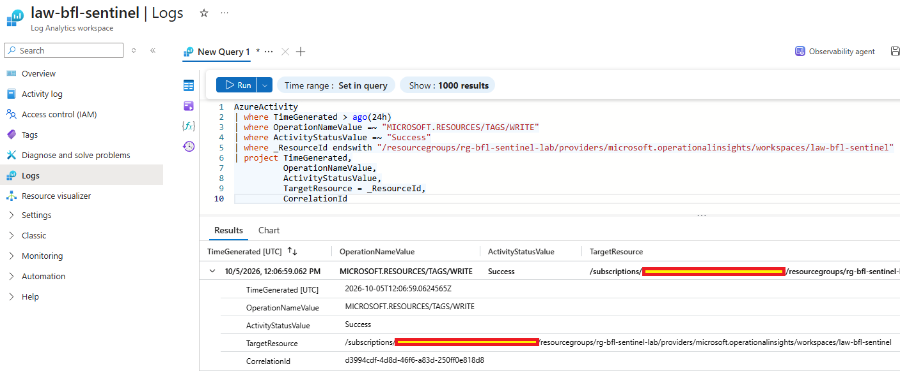

## 07 — Enabled scheduled rule

BFL-Day14-Workspace-Tag-Change is Enabled and Informational. Saved settings show every 5 minutes, last 15 minutes, threshold greater than 0, event grouping, incident creation and one-hour grouping of all rule alerts.

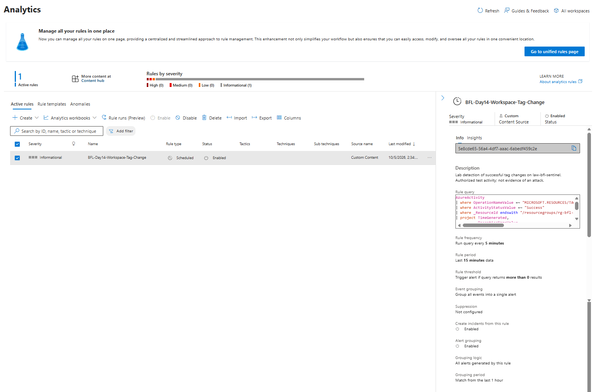

## 08 — New event after rule creation

A new successful workspace tag write appears at 12:38:03.783 UTC with correlation ID 29e1e880-73a8-425e-a663-50e89ddb0cc9. The older test is also visible.

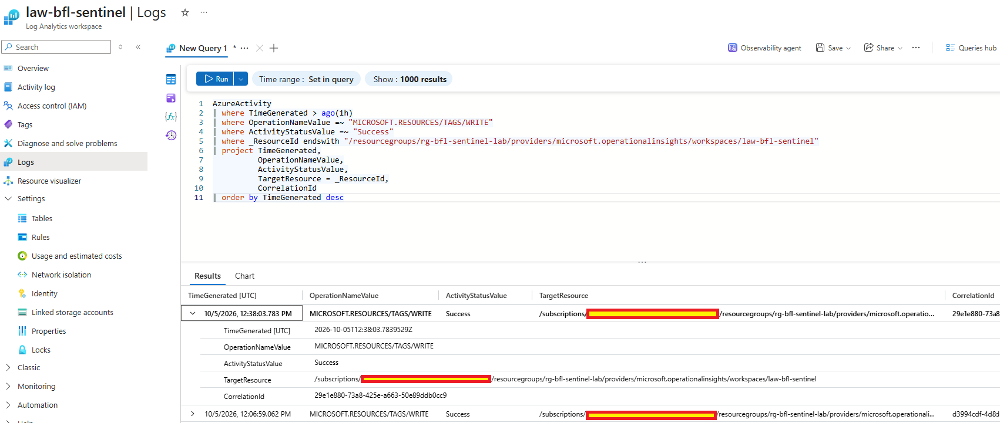

## 09 — Matching Sentinel alert linked to an incident

Despite the filename, this is the alert-details view. It shows the rule, one related query result, matching event time/correlation ID, workspace and incident association. Alert generation is shown at 14:45:46 local.

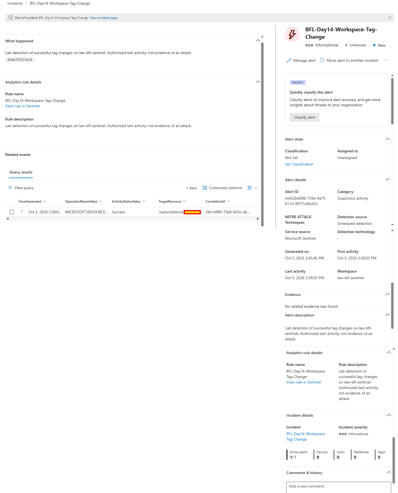

## 10 — Incident ID 3 with grouped alerts

The incident is Active, Informational and Unclassified, with two active alerts. Its first/last activity is 14:38:03 local and creation time is 14:45:47. No entities are mapped.

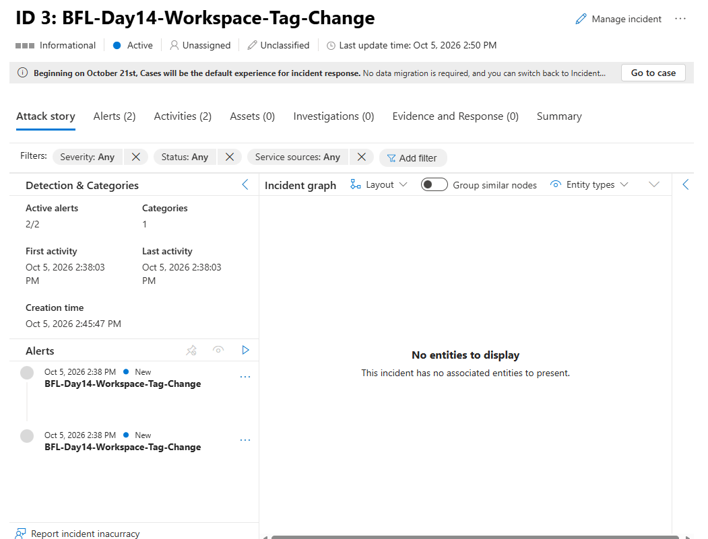

## 11 — Resolved benign test

Incident ID 3 is Resolved and classified Benign Positive. Both alerts are Resolved and Active alerts is 0. The saved determination and resolution-note text are not shown.

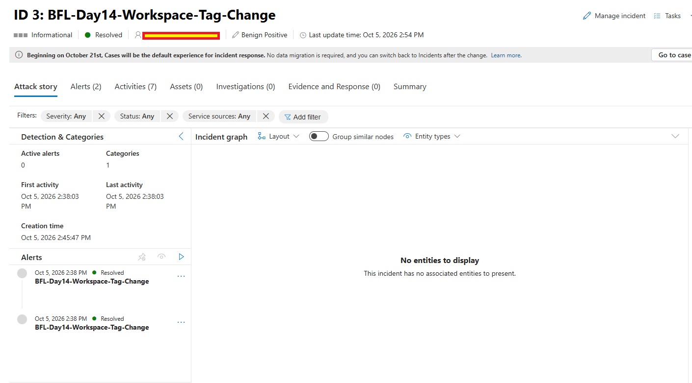

## 12 — Demonstration rule disabled

BFL-Day14-Workspace-Tag-Change remains present with status Disabled. The active-rule count is 0; this does not mean the workspace or data collection was removed.

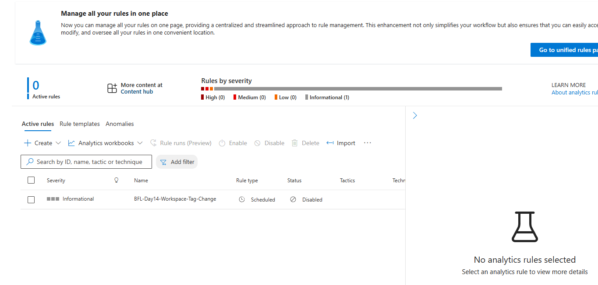

## Evidence boundaries

Images are preserved as uploaded. Screen 11 still displays an assignee email; replace it with a masked copy before sharing the portfolio further. Personal identifiers are not transcribed into the written evidence.

The event timestamps in Logs are UTC; Defender displays local times in these captures. The rule triggered on successful tag writes, not on a verified malicious action or a specific tag value. Two alerts in one incident are consistent with overlapping query windows; a rule-run export was not collected. Disabling the rule is evidenced as configuration, not as a subsequent negative test.

Day 13 reassessment remains a separate pending item.
