# Day 15 — Capstone evidence

**Session:** 2026-10-05. Twenty-two screenshots cover Azure RBAC detection and response, followed by endpoint compliance and Conditional Access block/recovery.

[Implementation and queries](../../docs/day-15.md) · [Test record](../../tests/day-15.md) · [Observed output](console-excerpts.md)

## 01 — Sara has no current role assignments

The Check access panel for Sara Security shows Current role assignments: 0 at rg-bfl-sentinel-lab. The Eligible assignments tab is not opened; this view does not establish its contents.

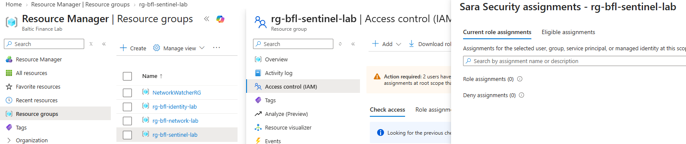

## 02 — Initial access denied

Opening the resource group in Sara's session fails with AuthorizationFailed / HTTP 403. The specific denied action is Microsoft.Resources/subscriptions/read at subscription scope; this capture is not a direct resourceGroups/read test.

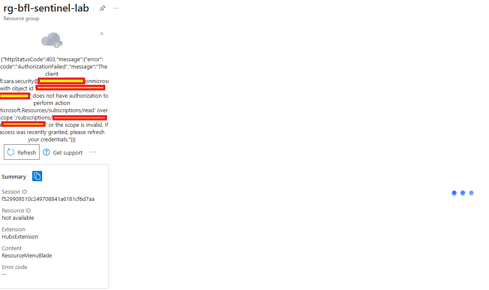

## 03 — Role-assignment detection enabled

BFL-Day15-Role-Assignment-Added is Enabled and Informational. It runs every 5 minutes over the last 15 minutes, triggers above 0 results, groups results into one alert and creates incidents. Alerts from the rule are grouped over one hour. The Day 14 rule remains Disabled.

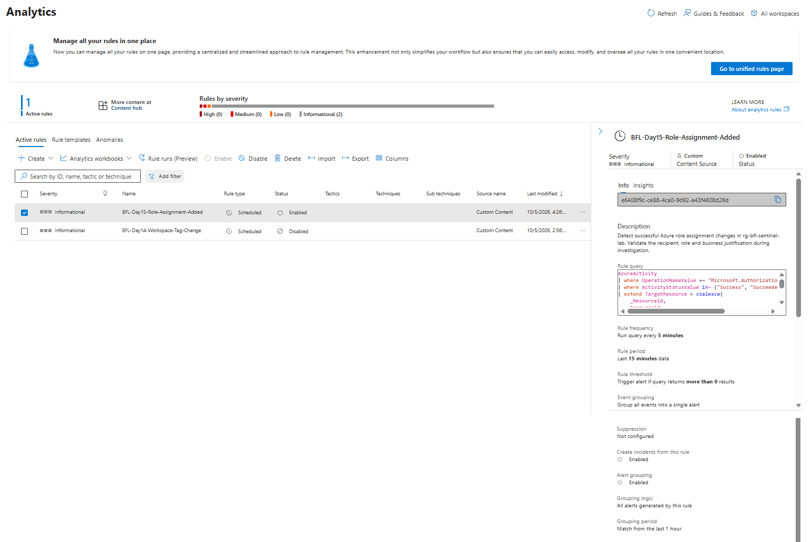

## 04 — Reader granted at resource-group scope

Sara Security has Reader at This resource: rg-bfl-sentinel-lab. The assignment is Active Permanent, not Eligible. It is temporary in the exercise only because it is explicitly removed later.

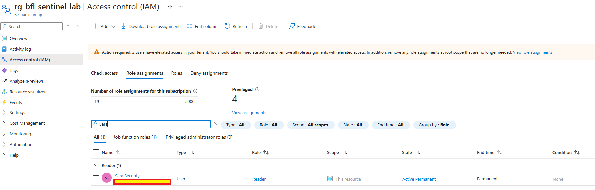

## 05 — Read access after the grant

The law-bfl-sentinel Overview page opens during the test in Sara's session. It identifies rg-bfl-sentinel-lab and North Europe. The session identity is part of the owner's test context, rather than a visible account badge in this capture.

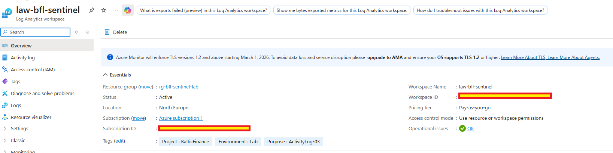

## 06 — Successful role assignment in AzureActivity

The query returns Microsoft.Authorization/roleAssignments/write with Success at 2026-10-05 14:30:01.7997622 UTC. Correlation ID fd08d57f-09e3-4f3a-bee9-8c2cfba55f65 and the assignment ID connect this operation to the alert and investigation. Caller identifies the actor, not the recipient.

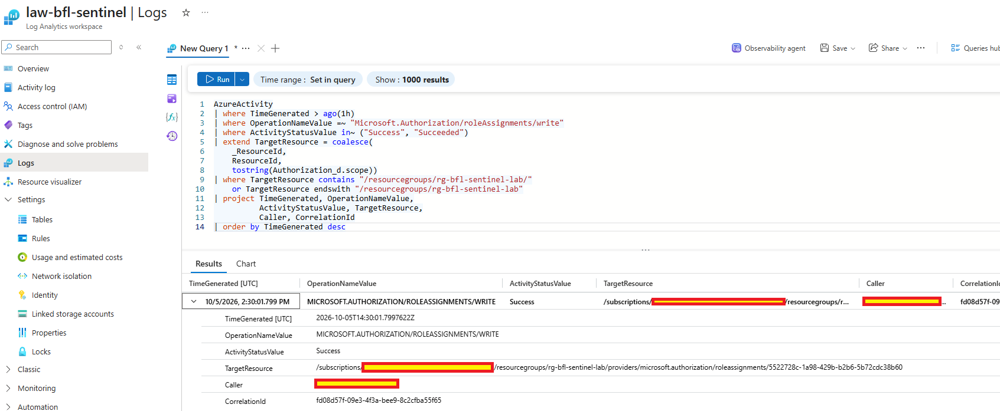

## 07 — Matching Sentinel alert

The alert shows one related successful event with the same correlation ID as screenshot 06, workspace law-bfl-sentinel and a linked incident. Generation is shown at 16:43:09 local; first activity is 16:30:01 local.

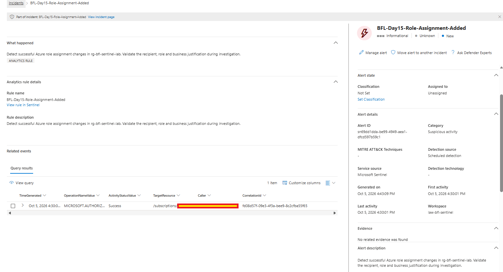

## 08 — Exact assignment investigated

The read-only Azure CLI query filters assignment 5522728c-1a98-429b-b2b6-5b72cdc38b60. Output identifies bfl.sara.security as recipient, Reader as role, and rg-bfl-sentinel-lab as scope. This establishes recipient and role independently of the log's Caller field.

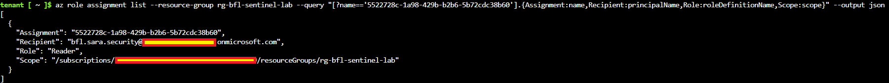

## 09 — Role removed

Sara's Current role assignments panel again shows Role assignments (0) at rg-bfl-sentinel-lab after removal. Effective denial is checked separately in screenshot 10.

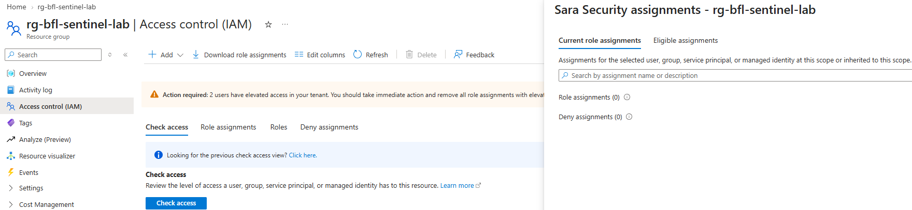

## 10 — Access denied after removal

The portal displays You don't have access for rg-bfl-sentinel-lab, error code 401, and denial of Microsoft.Resources/subscriptions/resourceGroups/read for Sara. This is the post-removal read test; its displayed code differs from the initial 403.

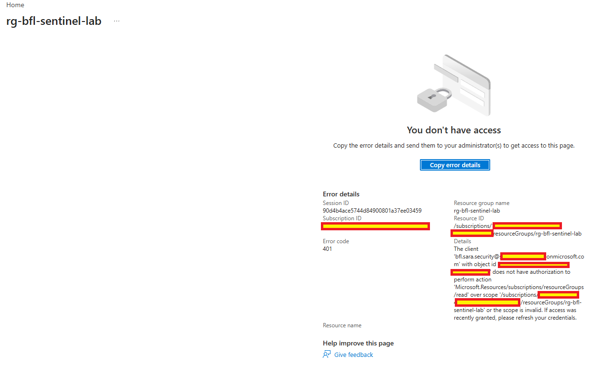

## 11 — Incident resolved and classified

Incident ID 5, BFL-Day15-Role-Assignment-Added, is Resolved / Benign Positive. Both linked alerts are Resolved and Active alerts is 0. The last update is 17:12 local. The precise saved determination and comment are not shown.

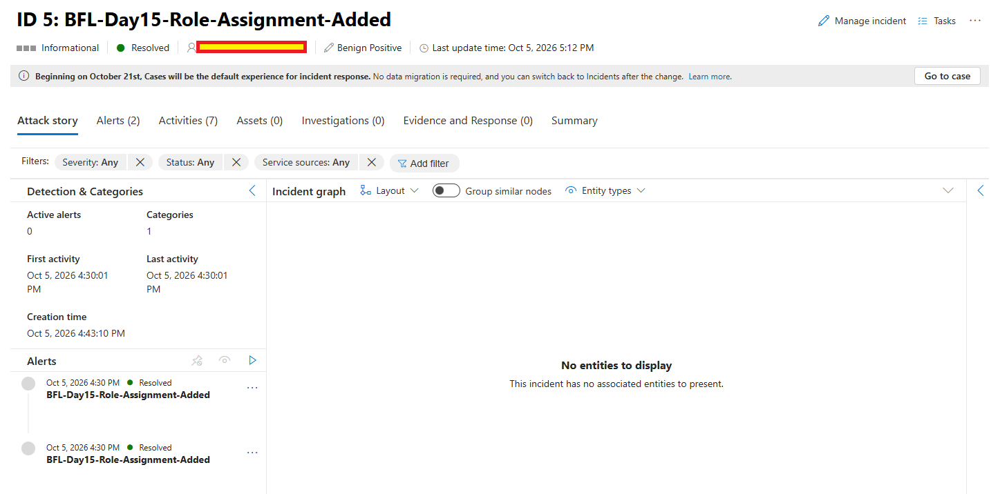

## 12 — Detection rule disabled

Both Day 15 and Day 14 demonstration rules are Disabled, with 0 active rules. The rules are retained; disabling them does not stop all workspace collection or prove zero ongoing cost.

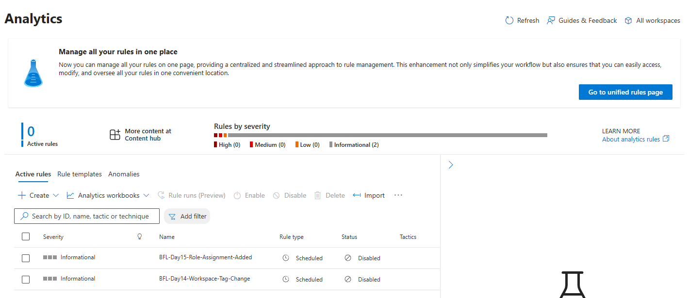

## 13 — Compliant endpoint baseline

BFL-WKS02 is Corporate, Intune-managed and Compliant, with Anna Finance as primary user and a 17:26 local check-in. This is the starting state for the second scenario.

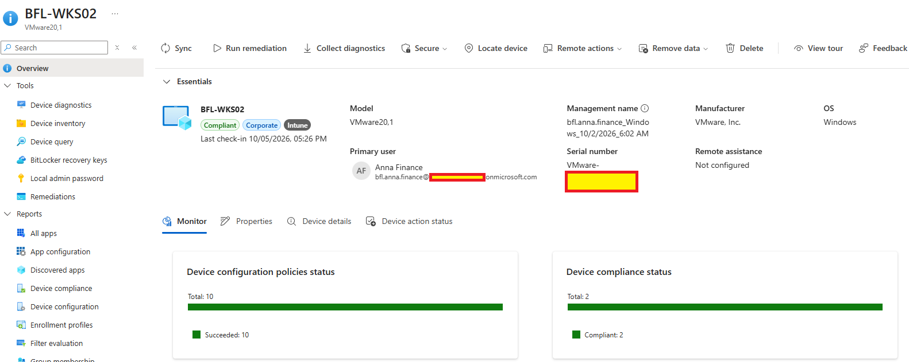

## 14 — Baseline compliance controls

BFL-WIN-Compliance-Pilot reports Firewall, Antivirus and Trusted Platform Module (TPM) as Compliant before the temporary OS-version requirement.

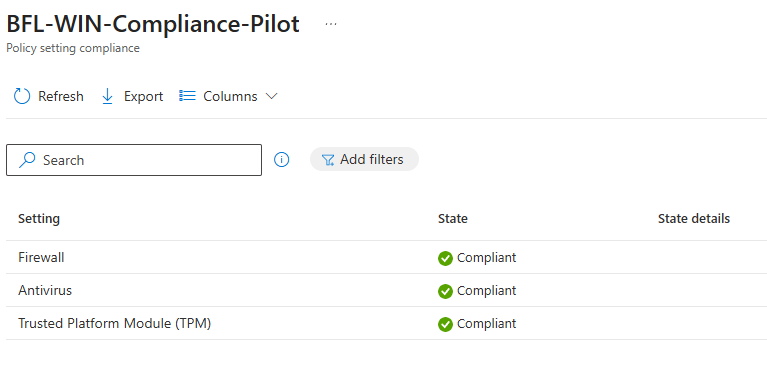

## 15 — Office 365 access before the test

Outlook Web is open in the owner's Anna Finance test session on BFL-WKS02. This establishes application access before the deliberate noncompliance; it is not by itself a Conditional Access evaluation report.

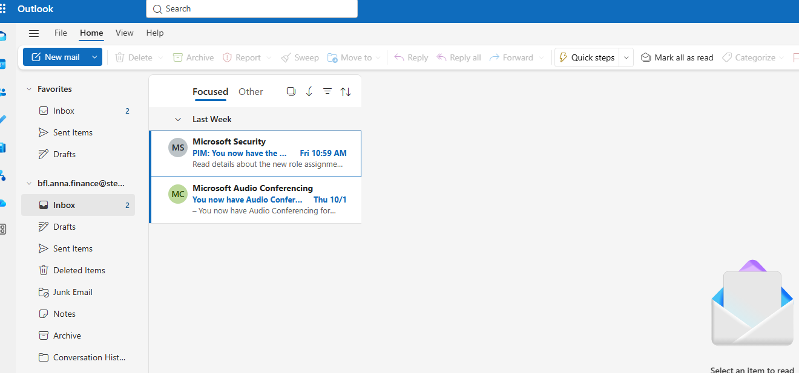

## 16 — Controlled minimum OS requirement

The saved policy requires Minimum OS version 10.0.26301.0, higher than the supplied winver build 26300.9457. Firewall, TPM and Antivirus remain Required. Mark device noncompliant is scheduled Immediately.

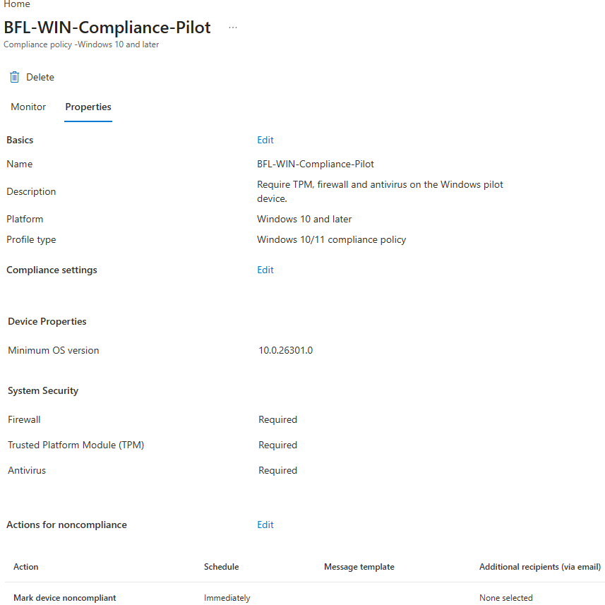

## 17 — Noncompliance isolated to OS version

BFL-WKS02's policy report shows Minimum OS version: Not compliant. Firewall, Antivirus and TPM remain Compliant, isolating the test condition without disabling these protections.

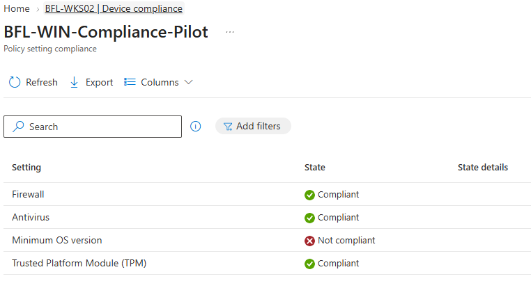

## 18 — Office 365 access blocked

The sign-in page states that the device must comply with the organization's compliance requirements. The applicable policy is established by the Entra sign-in event in screenshot 19.

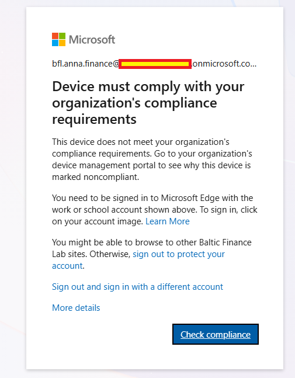

## 19 — Blocking Conditional Access policy identified

The interactive One Outlook Web sign-in at 15:57:05 UTC has status Failure. CA-BFL-Pilot-Require-Compliant-Device also has Failure with RequireCompliantDevice. The other displayed policies are Not applied for this event.

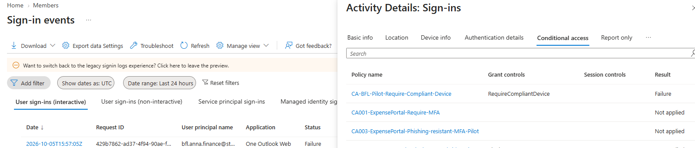

## 20 — Device compliance restored

BFL-WKS02 returns to Compliant, with a check-in at 18:21 local. This verifies the recovered device state after the rollback workflow; the final Minimum OS version field is not shown in this capture.

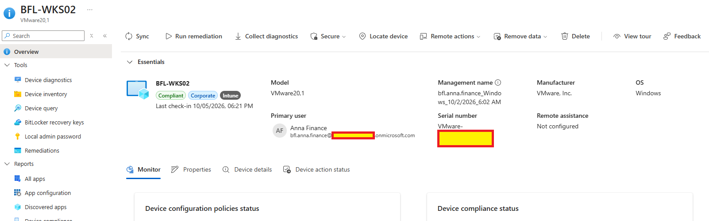

## 21 — Office 365 access restored

Outlook Web opens again in the Anna Finance test session following compliance recovery. The new sign-in's Conditional Access result is captured separately in screenshot 22.

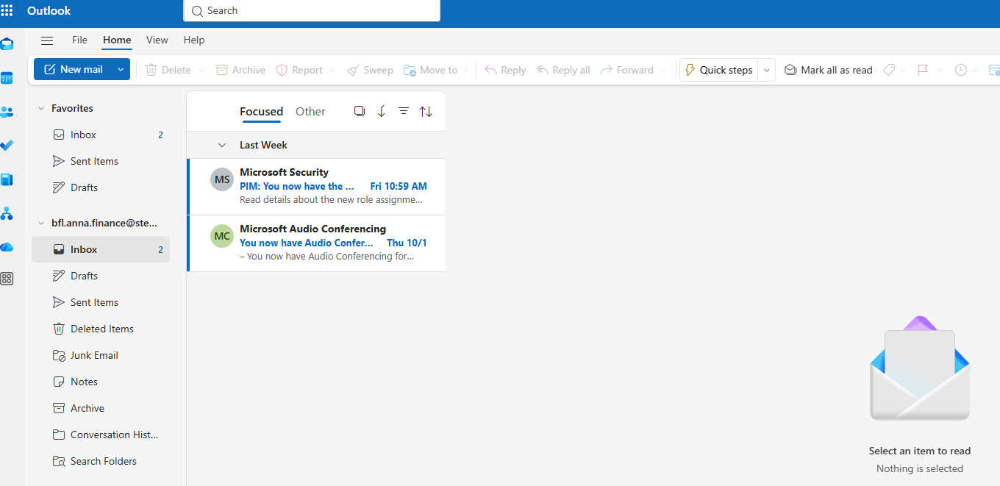

## 22 — Conditional Access succeeds after recovery

The interactive One Outlook Web sign-in at 16:23:48 UTC has status Success. CA-BFL-Pilot-Require-Compliant-Device evaluates RequireCompliantDevice as Success, establishing restored access with the control still applied.

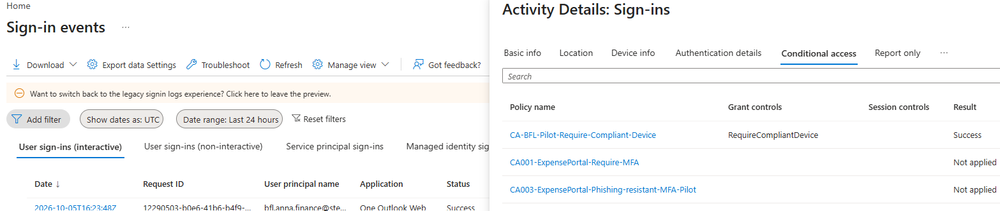

## Evidence boundaries

Screenshots record the owner's manual tests. AzureActivity and the Entra event-list timestamps are UTC; the Defender and device-overview captures display local time (UTC+2 in Poland on this date). The first scenario detected an authorized administrative change, not a verified attack. The second scenario was investigated in Intune and Entra; no Sentinel incident or MDE alert is claimed for it. Full exports and device-ID correlation across the Entra sign-in details were not collected.
